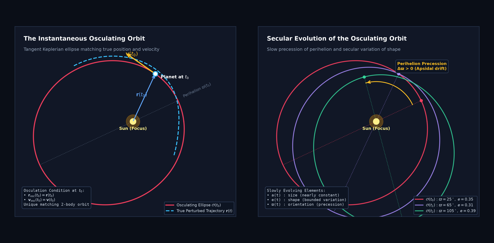
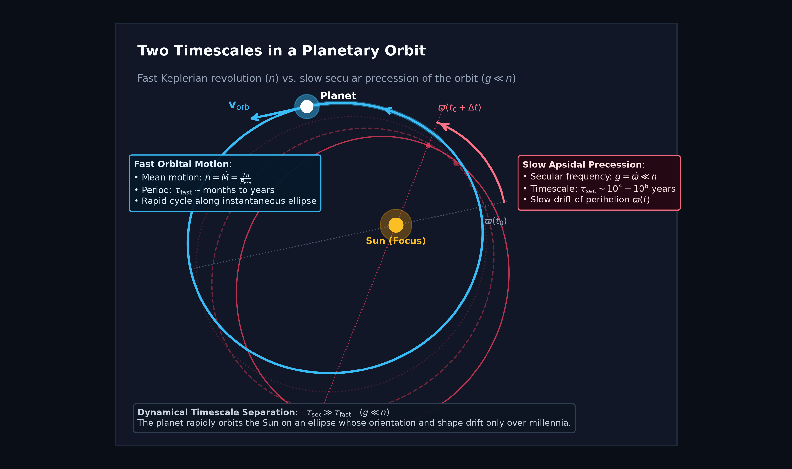
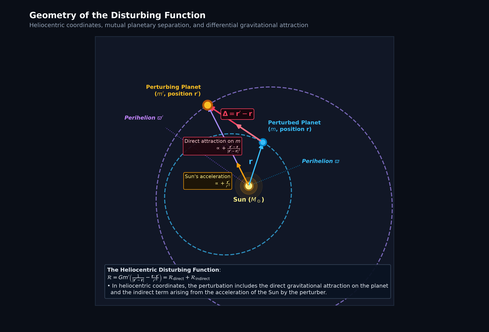
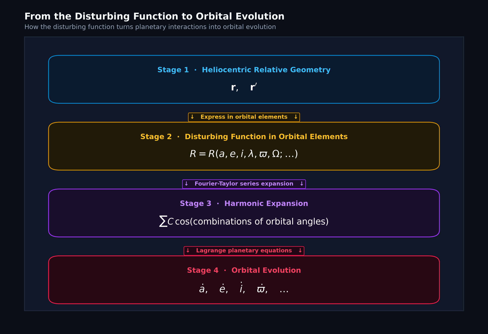
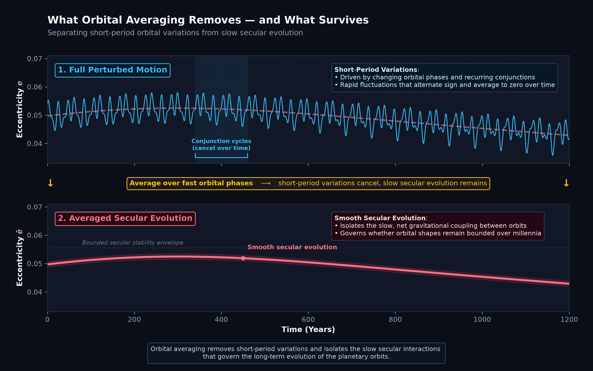
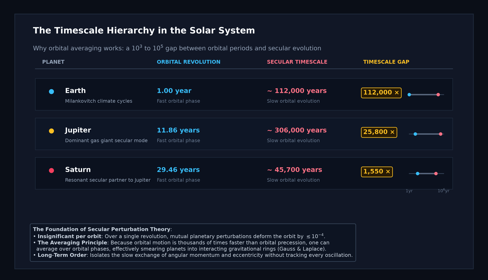
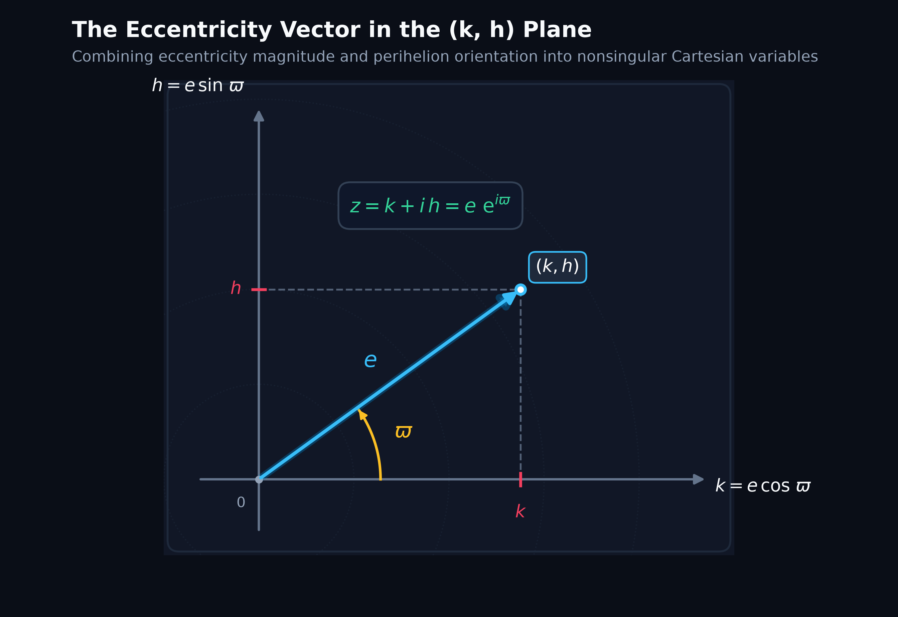
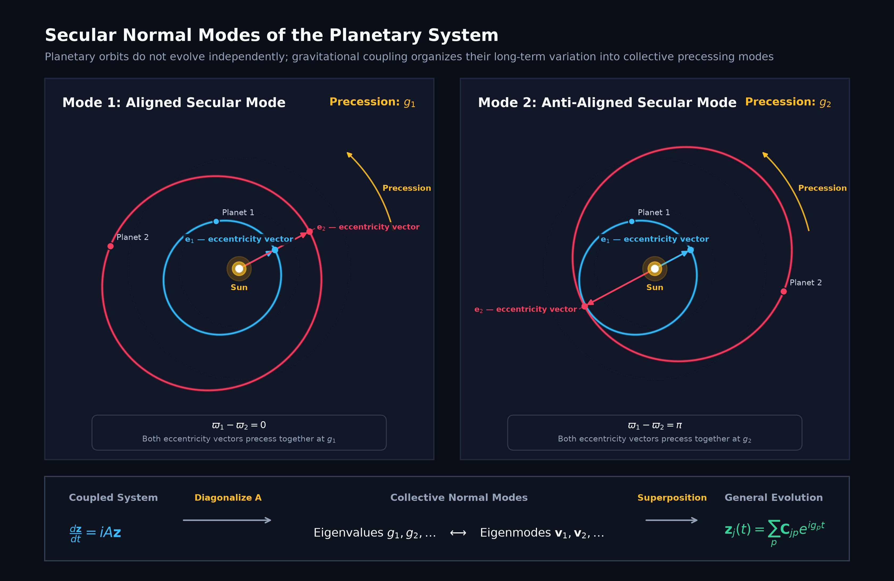
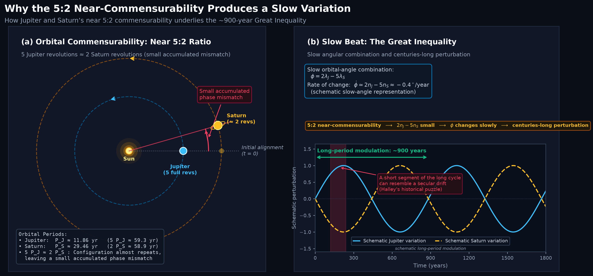
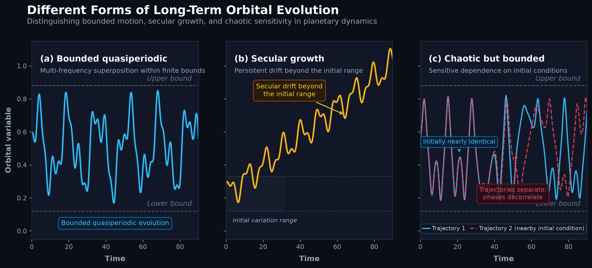

# Beyond Kepler: Perturbations and the Stability of the Solar System

This directory contains the standalone Python codebase and visualization suite supporting the technical article on **Beyond Kepler: Perturbations and the Stability of the Solar System**, published under **Stellar Priors**.

---

## 🗺️ Visual Architecture & Scientific Figures

The project provides self-contained, publication-grade scripts generating all 10 core scientific figures from first principles:

### 1. [The Instantaneous Osculating Orbit](code/generate_osculating_orbit_infographic.py)

* **Mechanics & Geometry**: Illustrates the concept of an osculating ellipse: at any instant $t_0$, the true perturbed trajectory $\mathbf{r}(t)$ shares an exact position $\mathbf{r}(t_0)$ and velocity $\mathbf{v}(t_0)$ with a unique unperturbed Keplerian ellipse.
* **Secular Evolution**: Under continuous interplanetary perturbations, the osculating parameters $(a, e, i, \varpi, \Omega)$ slowly drift over secular timescales, causing perihelion precession ($\Delta\varpi > 0$) and shape modulation.
* **Script**: `code/generate_osculating_orbit_infographic.py`

---

### 2. [Two Timescales in a Planetary Orbit](code/generate_two_timescales_orbit.py)

* **Dynamical Separation**: Contrasts the rapid Keplerian orbital motion ($n = 2\pi/P_{\mathrm{orb}}$) against the slow secular precession of the line of apsides ($g \ll n$).
* **Physical Significance**: The orbital period is measured in months to decades, while the orientation of the orbit precesses on timescales of tens to hundreds of thousands of years.
* **Script**: `code/generate_two_timescales_orbit.py`

---

### 3. [Geometry of the Disturbing Function](code/generate_disturbing_function_geometry.py)

* **Heliocentric Perturbation**: Decomposes the gravitational disturbing function into direct and indirect terms:
  $$\mathcal{R} = G m' \left( \frac{1}{|\mathbf{r}' - \mathbf{r}|} - \frac{\mathbf{r} \cdot \mathbf{r}'}{{r'}^3} \right) = \mathcal{R}_{\mathrm{direct}} + \mathcal{R}_{\mathrm{indirect}}$$
* **Non-Inertial Origin**: Because the coordinate system is anchored to the Sun, which is itself accelerated by the perturbing planet $m'$, the indirect term accounts for the apparent acceleration of the coordinate origin.
* **Script**: `code/generate_disturbing_function_geometry.py`

---

### 4. [From the Disturbing Function to Orbital Evolution](code/generate_disturbing_function_pipeline.py)

* **Conceptual Pipeline**: Traces the 4-stage mathematical workflow:
  1. **Heliocentric Relative Geometry**: Cartesian relative positions $\mathbf{r}, \mathbf{r}'$
  2. **Orbital Elements**: Parametrizing the interaction potential $R = R(a, e, i, \lambda, \varpi, \Omega; \ldots)$
  3. **Harmonic Expansion**: Expanding $R$ into cosine harmonics $\sum C \cos(\text{combinations of angles})$
  4. **Orbital Evolution**: Applying Lagrange's planetary equations to determine $\dot{a}, \dot{e}, \dot{i}, \dot{\varpi}, \ldots$
* **Script**: `code/generate_disturbing_function_pipeline.py`

---

### 5. [Orbital Averaging Concept](code/generate_orbital_averaging_infographic.py)

* **Filtering Timescales**: Demonstrates how averaging over fast orbital phases ($\lambda, \lambda'$) eliminates rapid short-period fluctuations while isolating the smooth secular drift $\bar{e}(t)$.
* **Ring Picture of Gauss**: Averaging spreads each planet's mass along its orbit as an elliptical wire, leaving purely secular gravitational torque between the ellipses.
* **Script**: `code/generate_orbital_averaging_infographic.py`

---

### 6. [The Timescale Hierarchy in the Solar System](code/generate_timescale_hierarchy.py)

* **Orders of Magnitude**: Visualizes the $10^3$ to $10^5$ timescale gap across the Solar System:
  * **Earth**: Orbital period $1.0\,\text{yr}$ vs. Milankovitch secular cycle $\sim 112,000\,\text{yr}$ ($112,000\times$ gap)
  * **Jupiter**: Orbital period $11.86\,\text{yr}$ vs. dominant secular mode $\sim 306,000\,\text{yr}$ ($25,800\times$ gap)
  * **Neptune**: Orbital period $164.8\,\text{yr}$ vs. secular timescale $\sim 1,940,000\,\text{yr}$ ($11,800\times$ gap)
* **Script**: `code/generate_timescale_hierarchy.py`

---

### 7. [The Eccentricity Vector in the (k,h) Plane](code/generate_eccentricity_vector.py)

* **Cartesian Regularization**: Expresses eccentricity and longitude of perihelion as nonsingular Cartesian coordinates:
  $$k = e \cos\varpi, \qquad h = e \sin\varpi, \qquad z = k + i h = e \exp(i\varpi)$$
* **Mathematical Property**: Eliminates coordinate singularities at $e = 0$, transforming nonlinear orbital equations into a linear system for small eccentricities.
* **Script**: `code/generate_eccentricity_vector.py`

---

### 8. [Secular Normal Modes in a Two-Planet System](code/generate_secular_normal_modes.py)

* **Collective Eigenmodes**: Models the Laplace-Lagrange secular matrix differential equation $\frac{d\mathbf{z}}{dt} = i A \mathbf{z}$:
  * **Mode 1 (Aligned)**: Perihelia precess together in phase at common secular frequency $g_1$.
  * **Mode 2 (Anti-Aligned)**: Perihelia precess in opposite directions with frequency $g_2$.
* **Stability Implication**: Because the eigenvalues $g_p$ are real, the solutions are purely oscillatory $\sum C_{jp} e^{i g_p t}$ and remain bounded for all time.
* **Script**: `code/generate_secular_normal_modes.py`

---

### 9. [The Great Inequality of Jupiter and Saturn](code/generate_great_inequality_infographic.py)

* **Near 5:2 Mean-Motion Resonance**: Jupiter completes approximately 5 revolutions while Saturn completes 2 ($5 P_J \approx 59.3\,\text{yr} \approx 2 P_S \approx 58.9\,\text{yr}$).
* **Long-Period Modulation**: The critical resonant angle $\phi = 2\lambda_J - 5\lambda_S$ has a small rate of change:
  $$\dot{\phi} \simeq 2n_J - 5n_S \approx -0.40^\circ/\text{year}$$
  generating a massive oscillation with a period of roughly **900 years** that historical astronomers originally mistook for an irreversible secular drift.
* **Script**: `code/generate_great_inequality_infographic.py`

---

### 10. [Regimes of Long-Term Orbital Evolution](code/generate_long_term_evolution_regimes.py)

* **Dynamical Categorization**: Contrasts three distinct dynamical regimes:
  * **Quasiperiodic (Laplace-Lagrange)**: Bounded, multi-periodic tori.
  * **Secular Growth (Unstable)**: Unbounded secular drift leading to orbital crossing.
  * **Chaotic (Poincaré & Laskar)**: Sensitive dependence on initial conditions, phase divergence, and diffusion.
* **Script**: `code/generate_long_term_evolution_regimes.py`

---

## 🚀 Getting Started

### 📋 Prerequisites

Python 3.8+ is required. Dependencies include standard scientific and plotting libraries (`numpy`, `scipy`, `matplotlib`, `pillow`, and `pytest`).

#### 1. Setup Virtual Environment

```bash
# Clone the repository
git clone https://github.com/victorastren/medium-public.git
cd medium-public/beyond_kepler_solar_system_stability

# Create and activate virtual environment
python3 -m venv .venv
source .venv/bin/activate  # On Windows: .venv\Scripts\activate
```

#### 2. Install Dependencies

```bash
pip install -r requirements.txt
```

#### 3. Generate All Scientific Figures

To re-render all 10 high-resolution publication figures in a single pass:

```bash
python3 code/generate_all_figures.py
```

Or run any generator script individually:

```bash
python3 code/generate_osculating_orbit_infographic.py
python3 code/generate_two_timescales_orbit.py
python3 code/generate_disturbing_function_geometry.py
python3 code/generate_disturbing_function_pipeline.py
python3 code/generate_orbital_averaging_infographic.py
python3 code/generate_timescale_hierarchy.py
python3 code/generate_eccentricity_vector.py
python3 code/generate_secular_normal_modes.py
python3 code/generate_great_inequality_infographic.py
python3 code/generate_long_term_evolution_regimes.py
```

All figures will be rendered into the `images/` directory.

---

## 🧪 Running the Test Suite

A comprehensive test suite validates both the celestial mechanics calculations and the figure generation pipeline:

```bash
# Run using standard library unittest
python3 tests/test_figure_generation.py

# Or run using pytest
pytest tests/ -v
```

The test suite validates:
1. **Keplerian Conic Geometry**: Conic section perihelion and aphelion formulas match analytic tolerances.
2. **Eccentricity Vector Invariance**: Norm preservation $|z| = \sqrt{k^2 + h^2} = e$ across all angles.
3. **Resonance Timescales**: Correctness of the Great Inequality frequency combination $2n_J - 5n_S \to T \approx 900\,\text{yr}$.
4. **Rendering Integrity**: Isolated generation of all 10 figures in temporary workspaces, confirming PNG magic headers, non-zero file sizes (> 40 KB), and minimum resolution requirements.

---

## 📚 Historical Context & Theoretical Foundations

1. **Kepler, J. (1609, 1619)**: Formulated the three empirical laws of planetary motion for isolated two-body systems.
2. **Newton, I. (1687)**: Established the Universal Law of Gravitation, recognizing that multi-planet systems deviate from pure Keplerian orbits.
3. **Lagrange, J.-L. (1774, 1776, 1781)**: Introduced the method of variation of orbital elements and demonstrated the secular invariance of planetary semimajor axes to first order.
4. **Laplace, P.-S. (1784, 1785)**: Explained the Great Inequality of Jupiter and Saturn through the near 5:2 resonance and formulated linear secular eigenvalue theory.
5. **Poincaré, H. (1892–1899)**: Demonstrated the non-integrability of the three-body problem and laid the foundations of modern nonlinear chaos.

---

## 📄 License

This project is licensed under the MIT License - see the [LICENSE](../LICENSE) file for details.
