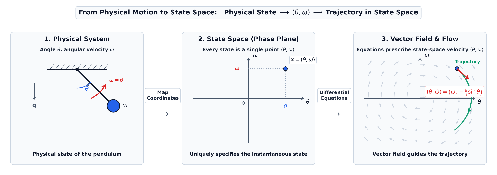
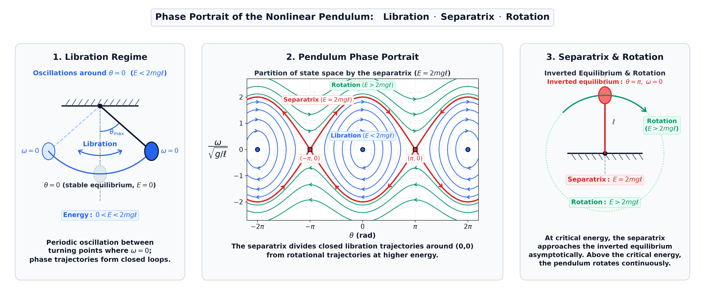
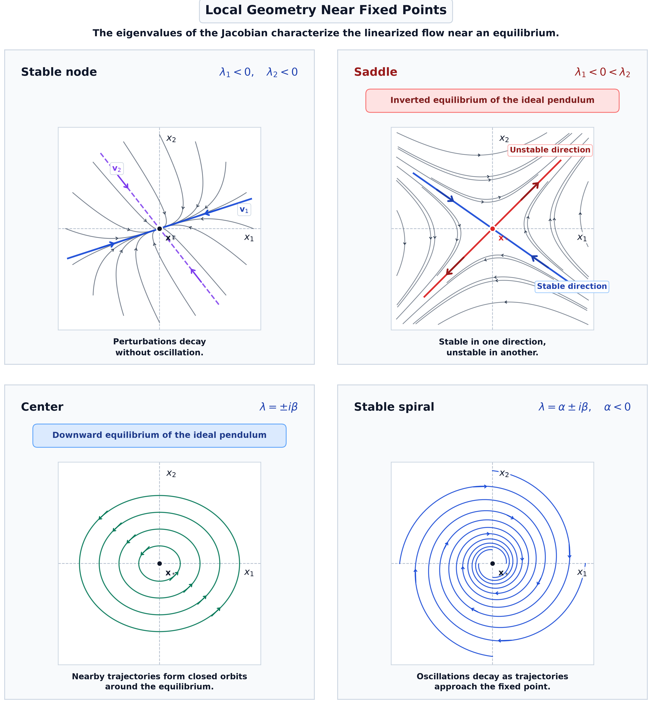
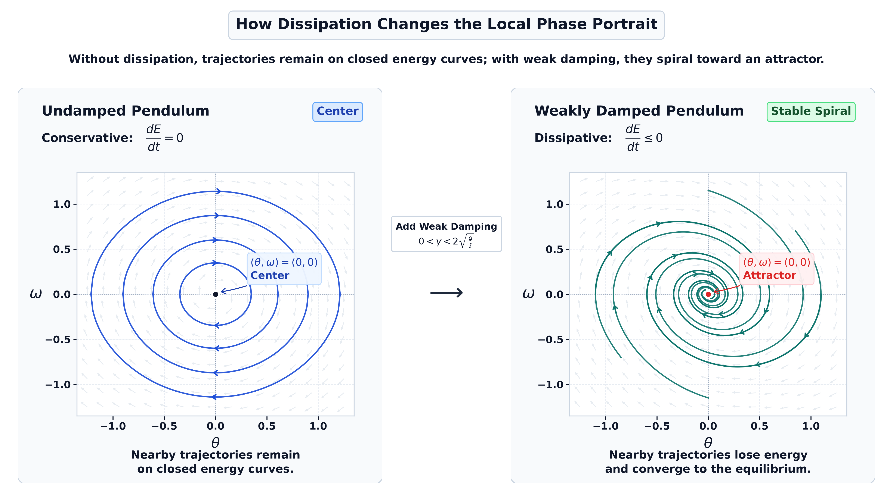
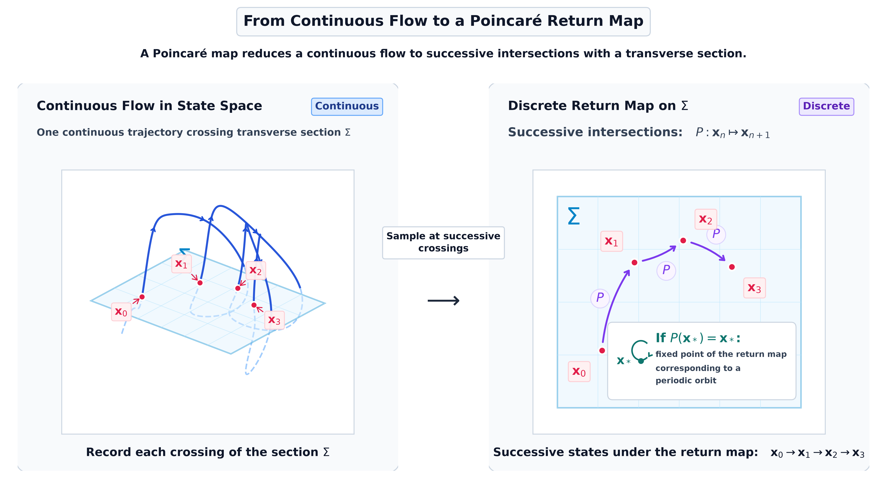

# Dynamical Systems: From Equations to Geometry

This directory contains the standalone Python codebase and visualization suite supporting the technical article on **Dynamical Systems: From Equations to Geometry**, published under **Stellar Priors**.

---

## 🗺️ Visual Architecture & Scientific Figures

The project provides self-contained, publication-grade scripts generating all 5 core scientific figures from first principles:

### 1. [From Physical Motion to State Space](code/generate_state_space_transition.py)

* **Conceptual Transition**: Follows the three-stage bridge from physical mechanics to geometric dynamics:
  1. **Physical Motion**: Real-space pendulum configuration parametrized by angle $\theta$ and angular velocity $\omega$.
  2. **State Point**: Representation of the instantaneous mechanical state as a point $(\theta, \omega)$ in the phase plane.
  3. **Vector Field**: First-order autonomous differential equations defining directional velocity vectors $(\dot{\theta}, \dot{\omega})$ and continuous trajectory flows.
* **Script**: `code/generate_state_space_transition.py`

---

### 2. [Nonlinear Pendulum Phase Portrait](code/generate_phase_portrait.py)

* **Hamiltonian Phase Space**: Visualizes global energy contours $E = \frac{1}{2}m\ell^2\omega^2 + mg\ell(1-\cos\theta)$ partitioned into distinct qualitative regimes:
  * **Librations ($E < 2mg\ell$)**: Bounded, closed oscillatory orbits surrounding the stable downward equilibrium.
  * **Separatrix ($E = 2mg\ell$)**: Homoclinic boundary trajectories asymptotic to the inverted saddle equilibria $(\pm\pi, 0)$.
  * **Rotations ($E > 2mg\ell$)**: Unbounded circulation trajectories with continuous sign-definite angular velocity.
* **Script**: `code/generate_phase_portrait.py`

---

### 3. [Local Stability Classification](code/generate_local_stability_classification.py)

* **Jacobian Eigenvalue Analysis**: Four-panel geometric taxonomy of local equilibria governed by $\det(J - \lambda I) = 0$:
  * **Stable Node ($\lambda_1, \lambda_2 < 0$)**: Real negative eigenvalues producing asymptotic contraction.
  * **Saddle Point ($\lambda_1 < 0 < \lambda_2$)**: Real eigenvalues of opposing sign with contracting and expanding invariant manifolds (inverted pendulum).
  * **Center ($\lambda = \pm i\beta$)**: Purely imaginary eigenvalues with closed nested orbits (ideal downward pendulum).
  * **Stable Spiral ($\lambda = \alpha \pm i\beta, \alpha < 0$)**: Complex conjugate eigenvalues with negative real part generating decaying damped oscillations.
* **Script**: `code/generate_local_stability_classification.py`

---

### 4. [Dissipation and Attractors](code/generate_dissipation_phase_portrait.py)

* **Conservative vs. Dissipative Geometry**: Contrasts the ideal Hamiltonian flow against a damped oscillator $\ddot{\theta} + \gamma\dot{\theta} + \frac{g}{\ell}\sin\theta = 0$:
  * **Undamped ($\gamma = 0$)**: Strict conservation of energy $\frac{dE}{dt} = 0$, trajectories confined to invariant energy curves.
  * **Weakly Damped ($\gamma > 0$)**: Strictly dissipative rate $\frac{dE}{dt} = -\gamma m\ell^2\omega^2 \le 0$, transforming the neutral center into an asymptotically stable attractor.
* **Script**: `code/generate_dissipation_phase_portrait.py`

---

### 5. [Poincaré Section and Return Map](code/generate_poincare_return_map.py)

* **Dimension Reduction & Qualitative Dynamics**:
  * **Continuous Flow**: Trajectory in 3D state space repeatedly piercing a transverse section $\Sigma$.
  * **Discrete Return Map**: Successive section crossings defining the map $P: \mathbf{x}_n \mapsto \mathbf{x}_{n+1}$.
  * **Periodic Orbits**: Closed continuous orbits represented compactly as fixed points $P(\mathbf{x}_*) = \mathbf{x}_*$, simplifying orbital stability analysis.
* **Script**: `code/generate_poincare_return_map.py`

---

## 📁 Directory Structure

```
dynamical_systems_interpreting_motion/
├── README.md                                 # Documentation & figure gallery
├── requirements.txt                          # Python dependencies
├── images/                                   # Pre-rendered high-res PNG infographics
│   ├── state_space_transition.png
│   ├── pendulum_phase_portrait.png
│   ├── local_stability_classification.png
│   ├── dissipation_phase_portrait.png
│   └── poincare_return_map.png
├── code/                                     # Portable generation scripts
│   ├── generate_state_space_transition.py
│   ├── generate_phase_portrait.py
│   ├── generate_local_stability_classification.py
│   ├── generate_dissipation_phase_portrait.py
│   ├── generate_poincare_return_map.py
│   └── generate_all_figures.py               # Master batch runner
└── tests/                                    # Test suite
    ├── __init__.py
    └── test_figure_generation.py             # Numerical physics and rendering integrity tests
```

---

## 💻 Installation & Dependencies

The visualization suite requires Python 3.9+ with standard scientific libraries:

```bash
# Clone the repository and navigate to the project directory
cd dynamical_systems_interpreting_motion

# Create and activate a clean virtual environment
python3 -m venv venv
source venv/bin/activate

# Install required dependencies
pip install -r requirements.txt
```

### Dependencies
* `numpy >= 1.22.0`: Numerical integration grids and vector field evaluation
* `scipy >= 1.8.0`: ODE integration (`scipy.integrate.odeint` / `solve_ivp`)
* `matplotlib >= 3.5.0`: Editorial vector and raster figure rendering
* `pillow >= 9.0.0`: Image dimension and header verification
* `pytest >= 7.0.0`: Automated test execution

---

## 🚀 Usage

### Generate All Scientific Figures
To re-render all 5 high-resolution publication figures into `images/`:

```bash
python3 code/generate_all_figures.py
```

### Generate Figures Individually
Each script is completely self-contained and accepts an optional `--output` path:

```bash
python3 code/generate_state_space_transition.py
python3 code/generate_phase_portrait.py
python3 code/generate_local_stability_classification.py
python3 code/generate_dissipation_phase_portrait.py
python3 code/generate_poincare_return_map.py
```

---

## 🧪 Running the Test Suite

A comprehensive test suite validates both the mathematical formulations and the figure generation pipeline:

```bash
# Run using standard library unittest
python3 -m unittest tests/test_figure_generation.py

# Or run using pytest
pytest tests/ -v
```

The test suite validates:
1. **Jacobian Stability & Eigenvalues**: Analytical Jacobian evaluations for downward center ($\pm i\sqrt{g/\ell}$) and inverted saddle ($\pm\sqrt{g/\ell}$).
2. **2D Linear Stability Taxonomy**: Real vs. imaginary eigenvalue signatures across node, saddle, center, and spiral configurations.
3. **Hamiltonian Energy Conservation**: Energy conservation along nonlinear flow curves, turning point angles in libration, separatrix velocity $2\cos(\theta/2)$, and rotation velocity bounds.
4. **Damped Dissipation Rate**: Negative semi-definite rate $\frac{dE}{dt} \le 0$ and weak damping spiral condition $\gamma^2 < 4g/\ell$.
5. **Rendering Integrity**: Isolated generation of all 5 figures in temporary workspaces, confirming PNG magic headers, non-zero file sizes (> 40 KB), and minimum resolution requirements.

---

## 📚 References & Further Reading

1. **Poincaré, H. (1881–1886).** *Mémoire sur les courbes définies par une équation différentielle* / *Sur les courbes définies par les équations différentielles.* Journal de Mathématiques Pures et Appliquées. Four parts: [Part I (1881)](http://www.numdam.org/item/JMPA_1881_3_7__375_0/), [Part II (1882)](http://www.numdam.org/item/JMPA_1882_3_8__251_0/), [Part III (1885)](http://www.numdam.org/item/JMPA_1885_4_1__167_0/), [Part IV (1886)](http://www.numdam.org/item/JMPA_1886_4_2__151_0/).
2. **Poincaré, H. (1890).** *Sur le problème des trois corps et les équations de la dynamique.* Acta Mathematica, 13, 1–270. [Henri Poincaré Papers](https://henripoincarepapers.univ-nantes.fr/en/bibliohp/ajax.php?bibkey=hp1890am).
3. **Poincaré, H. (1892–1899).** *Les Méthodes Nouvelles de la Mécanique Céleste.* Gauthier-Villars, Paris.
4. **Lyapunov, A. M. (1892; French trans. 1907).** *Problème général de la stabilité du mouvement.* Annales de la Faculté des Sciences de Toulouse, 9, 203–474. [Numdam](http://www.numdam.org/item/AFST_1907_2_9__203_0/).
5. **Birkhoff, G. D. (1927).** *Dynamical Systems.* American Mathematical Society Colloquium Publications, Vol. 9.
6. **Guckenheimer, J., & Holmes, P. (1983).** *Nonlinear Oscillations, Dynamical Systems, and Bifurcations of Vector Fields.* Springer-Verlag.
7. **Arnold, V. I. (1992).** *Ordinary Differential Equations.* Springer-Verlag, Berlin Heidelberg. [Springer](https://link.springer.com/book/9783540345633).
8. **Perko, L. (2001).** *Differential Equations and Dynamical Systems.* 3rd ed., Springer, Texts in Applied Mathematics, Vol. 7. [10.1007/978-1-4613-0003-8](https://doi.org/10.1007/978-1-4613-0003-8) · [Springer](https://link.springer.com/book/10.1007/978-1-4613-0003-8).
9. **Hirsch, M. W., Smale, S., & Devaney, R. L. (2013).** *Differential Equations, Dynamical Systems, and an Introduction to Chaos.* 3rd ed., Academic Press. [Elsevier](https://shop.elsevier.com/books/differential-equations-dynamical-systems-and-an-introduction-to-chaos/hirsch/978-0-12-382010-5).
10. **Strogatz, S. H. (2015).** *Nonlinear Dynamics and Chaos: With Applications to Physics, Biology, Chemistry, and Engineering.* 2nd ed., Westview Press.

---

## 📄 License

This project is licensed under the MIT License - see the [LICENSE](../LICENSE) file for details.
