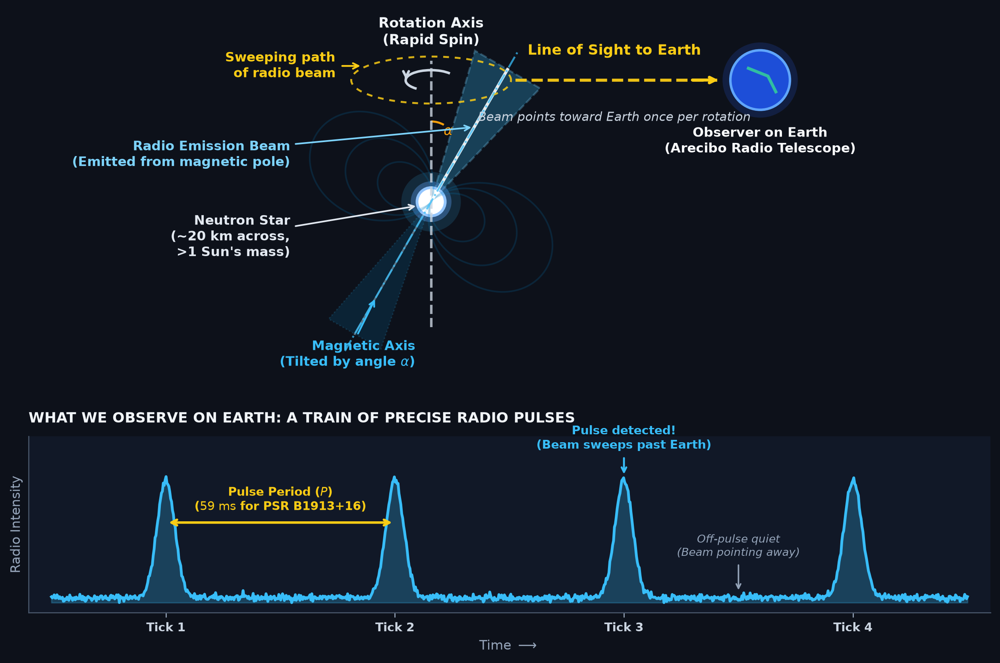
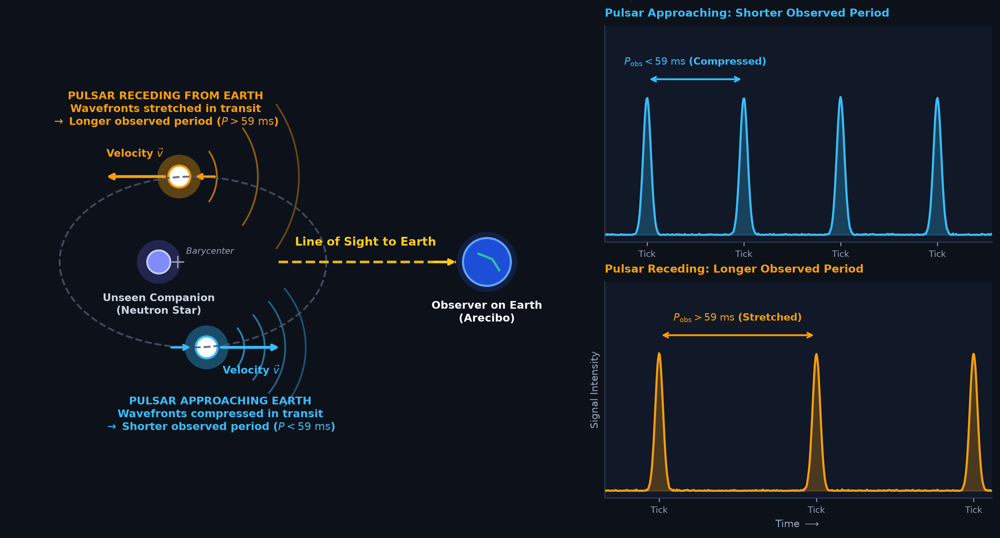
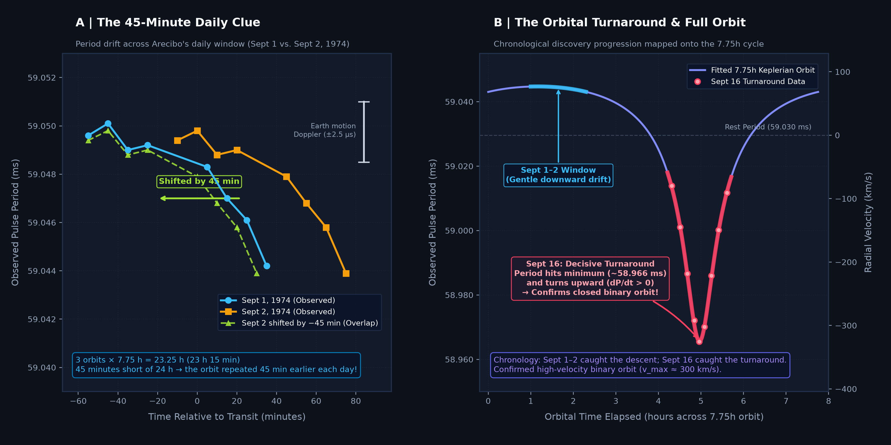
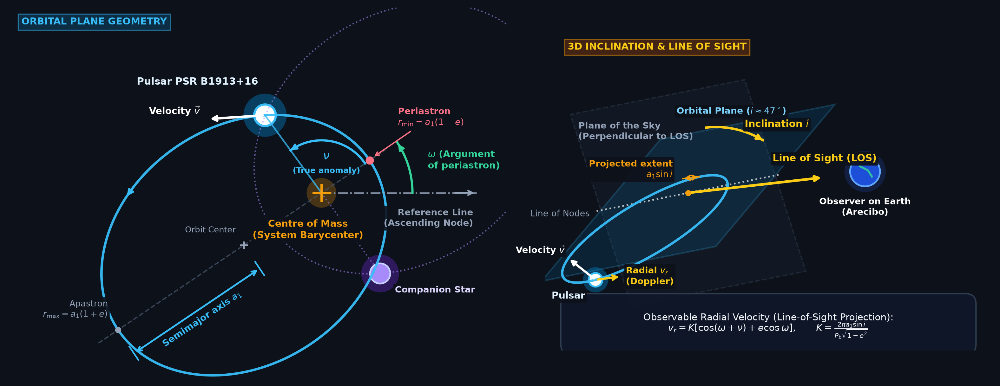
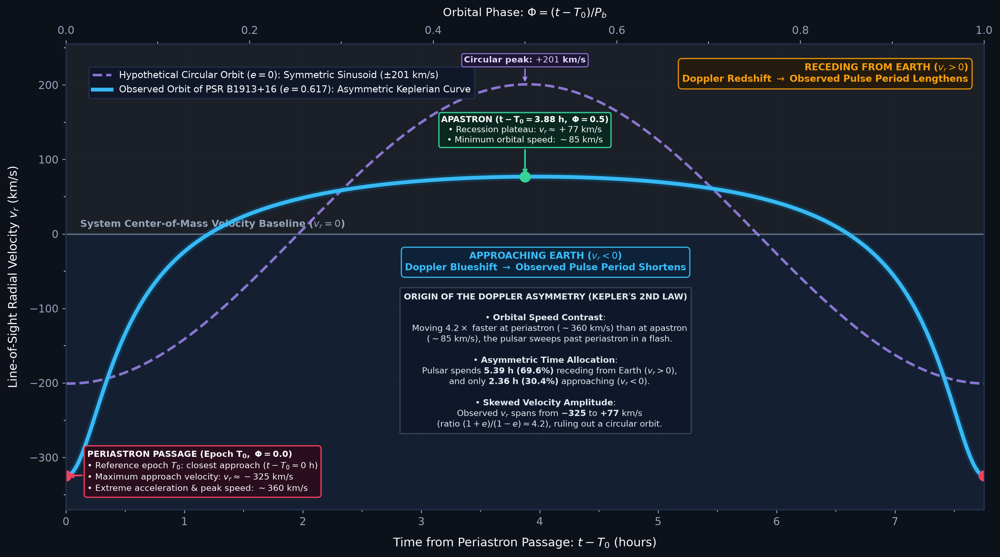
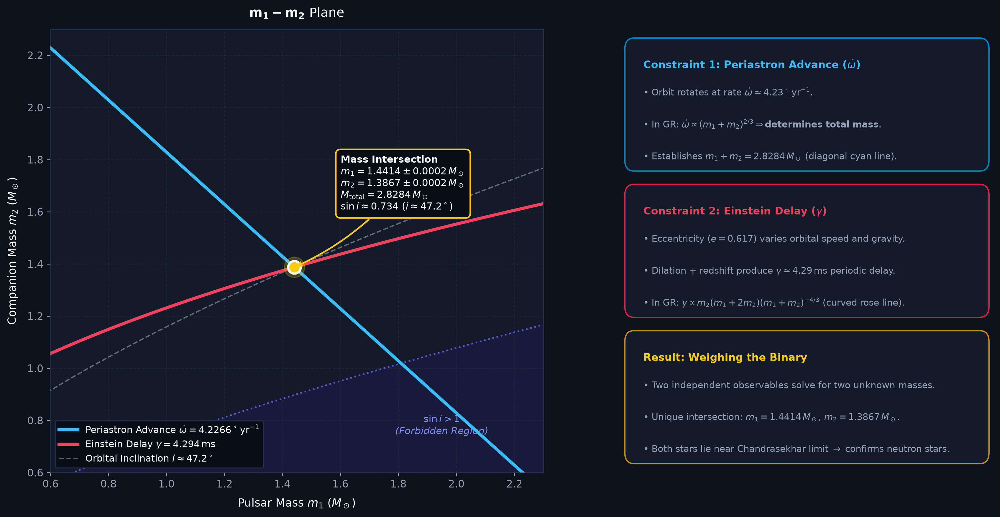
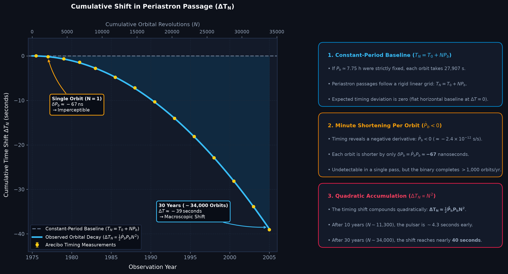

# The Discovery of the Hulse-Taylor Binary Pulsar (PSR B1913+16)

This directory contains the standalone Python codebase and visualization suite supporting the technical article on the **Discovery and Physics of the Hulse-Taylor Binary Pulsar (PSR B1913+16)**, published under **Stellar Priors**.

In 1974, Russell A. Hulse and Joseph H. Taylor Jr. discovered the first binary pulsar using the 305-meter Arecibo radio telescope. The system provided the first natural astrophysical laboratory for testing Einstein’s General Theory of Relativity in strong gravitational fields, culminating in the first indirect detection of gravitational waves and the 1993 Nobel Prize in Physics.

---

## 🗺️ Visual Architecture & Scientific Figures

The project provides self-contained, publication-grade scripts generating all core scientific figures from first principles:

### 1. [The Pulsar Lighthouse Model](code/generate_pulsar_infographic.py)

* **Physics & Geometry**: Illustrates a rapidly rotating, highly magnetized neutron star (~20 km diameter, $>1.4\,M_\odot$). Narrow beams of synchrotron radio emission radiate outward along the magnetic dipole axis, which is inclined by angle $\alpha$ relative to the rotation axis.
* **Observed Signal**: As the star spins every $59\,\text{ms}$, the sweeping beam intersects Earth’s line of sight once per revolution, generating a train of periodic radio pulses.
* **Script**: `code/generate_pulsar_infographic.py`

---

### 2. [Orbital Doppler Effect](code/generate_doppler_orbit_infographic.py)

* **Physics & Geometry**: Depicts how orbital motion modulates the observed pulse arrival times along the line of sight to Earth.
* **Doppler Mechanism**:
  * **Approaching Earth** ($v_r < 0$): Wavefronts are compressed along the line of sight, shortening the apparent pulse period ($P_{\text{obs}} < 59\,\text{ms}$).
  * **Receding from Earth** ($v_r > 0$): Wavefronts are stretched, lengthening the apparent pulse period ($P_{\text{obs}} > 59\,\text{ms}$).
* **Script**: `code/generate_doppler_orbit_infographic.py`

---

### 3. [Hulse's 1974 Discovery Evidence](code/generate_hulse_discovery_evidence.py)

* **Historical Data & Context**: Reconstructs Russell Hulse's discovery logs from his September 1974 observing notebook at Arecibo.
  * **Panel A (The 45-Minute Daily Clue)**: Demonstrates that shifting the Sept 2 observation by $-45$ minutes produces an exact overlap with Sept 1. Because $3 \times 7.75\,\text{h} = 23.25\,\text{h}$ (45 minutes short of a 24-hour sidereal day), the binary orbit advanced by 45 minutes each day relative to Arecibo’s fixed transit window.
  * **Panel B (The Decisive Turnaround)**: On September 16, 1974, Hulse tracked the pulse period through its minimum ($\sim 58.966\,\text{ms}$) as it turned upward ($dP/dt > 0$), confirming a high-velocity, closed Keplerian binary orbit ($v_{\text{orb}} \sim 300\,\text{km/s}$).
* **Script**: `code/generate_hulse_discovery_evidence.py`

---

### 4. [Keplerian Binary Orbit Geometry](code/generate_keplerian_orbit_infographic.py)

* **Orbital Mechanics**: Reconstructs the 5 fundamental Keplerian orbital parameters from timing:
  * **Orbital Plane**: Semimajor axis $a_1$, eccentricity $e = 0.617$, true anomaly $\nu$, argument of periastron $\omega$, and center of mass.
  * **3D Projection**: Inclination $i \approx 47^\circ$ relative to the Plane of the Sky, projecting the light-travel time extent $x = a_1 \sin i / c \approx 2.342\,\text{light-seconds}$.
* **Radial Velocity Formula**:
  $$v_r = K \left[\cos(\omega + \nu) + e\cos\omega\right], \qquad K = \frac{2\pi a_1\sin i}{P_b\sqrt{1-e^2}}$$
* **Script**: `code/generate_keplerian_orbit_infographic.py`

---

### 5. [Radial Velocity Doppler Curve](code/generate_radial_velocity_curve.py)

* **Kepler's Second Law Signature**: Compares the observed asymmetric Doppler curve ($e = 0.617$) against a symmetric circular sinusoid ($e = 0$).
* **Kinematic Asymmetry**:
  * **Periastron ($t = T_0$)**: Pulsar sweeps through closest approach at peak speeds ($\sim 360\,\text{km/s}$), reaching maximum approach velocity $v_r \approx -325\,\text{km/s}$ in a steep turnaround.
  * **Apastron**: Pulsar slows down to $\sim 85\,\text{km/s}$, lingering across a broad recession plateau ($v_r \approx +77\,\text{km/s}$).
  * The pulsar spends **69.6% (5.39 h)** of each orbit receding and only **30.4% (2.36 h)** approaching Earth.
* **Script**: `code/generate_radial_velocity_curve.py`

---

### 6. [Relativistic Mass-Mass Constraint Plane](code/generate_mass_mass_diagram.py)

* **Post-Keplerian Constraints**: Demonstrates how measuring two relativistic timing corrections uniquely determines both stellar masses:
  * **Periastron Advance** ($\dot{\omega} = 4.2266^\circ\,\text{yr}^{-1}$): Fixes the total mass $m_1 + m_2 = 2.8284\,M_\odot$.
  * **Einstein Delay** ($\gamma = 4.294\,\text{ms}$): Combined transverse Doppler and gravitational redshift constraint.
* **Result**: Unique intersection at $m_1 = 1.4414 \pm 0.0002\,M_\odot$ (pulsar) and $m_2 = 1.3867 \pm 0.0002\,M_\odot$ (companion), proving both objects are neutron stars.
* **Script**: `code/generate_mass_mass_diagram.py`

---

### 7. [Cumulative Orbital Period Decay & Gravitational Radiation](code/generate_period_decay_infographic.py)

* **Gravitational Wave Proof**: Shows the cumulative shift in the time of periastron passage ($\Delta T_N$) over 30+ years of timing:
  $$\Delta T_N \approx \frac{1}{2}\dot{P}_b P_b N^2$$
* **Macroscopic Accumulation**: While each orbit shortens by only $\delta P_b \approx -67\,\text{nanoseconds}$ ($\dot{P}_b \approx -2.423 \times 10^{-12}\,\text{s/s}$), completing over 1,130 orbits/year accumulates into an unmistakable parabolic delay of nearly **40 seconds** over three decades, matching Einstein’s quadrupole formula to within 0.2%.
* **Script**: `code/generate_period_decay_infographic.py`

---

## 🚀 Getting Started

### 📋 Prerequisites

Python 3.8+ is required. Dependencies include standard scientific libraries (`numpy`, `scipy`, `matplotlib`, `pillow`, and `pytest`).

#### 1. Setup Virtual Environment

```bash
# Clone repository if you haven't already
git clone https://github.com/victorastren/medium-public.git
cd medium-public/hulse_taylor_pulsar_discovery

# Create and activate a virtual environment
python3 -m venv .venv
source .venv/bin/activate  # On Windows: .venv\Scripts\activate
```

#### 2. Install Dependencies

* **From the repository root (`medium-public/`)**:
  ```bash
  pip install -r hulse_taylor_pulsar_discovery/requirements.txt
  ```

* **From this project directory (`hulse_taylor_pulsar_discovery/`)**:
  ```bash
  pip install -r requirements.txt
  ```

---

## 🏃 Execution Guide

### Generate All Figures
To build or update all 7 figures at once, run the master pipeline runner:

```bash
python3 code/generate_all_figures.py
```
Output images are automatically saved to `images/`. You can also specify an alternate output directory:
```bash
python3 code/generate_all_figures.py /path/to/custom_output/
```

### Generate Individual Figures
All scripts are standalone and can be run independently from any directory:

```bash
# Example: Generate the radial velocity Doppler curve
python3 code/generate_radial_velocity_curve.py

# Example: Generate the mass-mass constraint diagram
python3 code/generate_mass_mass_diagram.py
```

### Running Automated Unit Tests
To verify mathematical formulas, Keplerian solver convergence, and PNG image generation integrity:

```bash
pytest tests/ -v
```

---

## 📁 Directory Structure

```
hulse_taylor_pulsar_discovery/
├── README.md                                 # This documentation & figure gallery
├── requirements.txt                          # Python dependencies
├── images/                                   # Pre-rendered high-res PNG infographics
│   ├── pulsar_lighthouse_infographic.png
│   ├── binary_orbit_doppler_infographic.png
│   ├── hulse_discovery_evidence.png
│   ├── keplerian_orbit_geometry.png
│   ├── radial_velocity_doppler_curve.png
│   ├── mass_mass_diagram.png
│   └── psr_period_decay_infographic.png
├── code/                                     # Portable generation scripts
│   ├── generate_pulsar_infographic.py
│   ├── generate_doppler_orbit_infographic.py
│   ├── generate_hulse_discovery_evidence.py
│   ├── generate_keplerian_orbit_infographic.py
│   ├── generate_radial_velocity_curve.py
│   ├── generate_mass_mass_diagram.py
│   ├── generate_period_decay_infographic.py
│   └── generate_all_figures.py               # Master batch runner
└── tests/                                    # Test suite
    └── test_figure_generation.py             # Numerical and image integrity tests
```

---

## 📄 License

This project is licensed under the MIT License - see the [LICENSE](../LICENSE) file for details.
