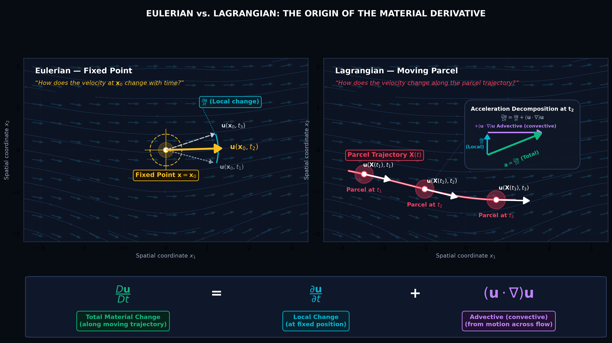
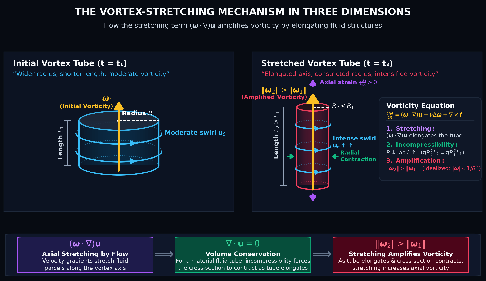
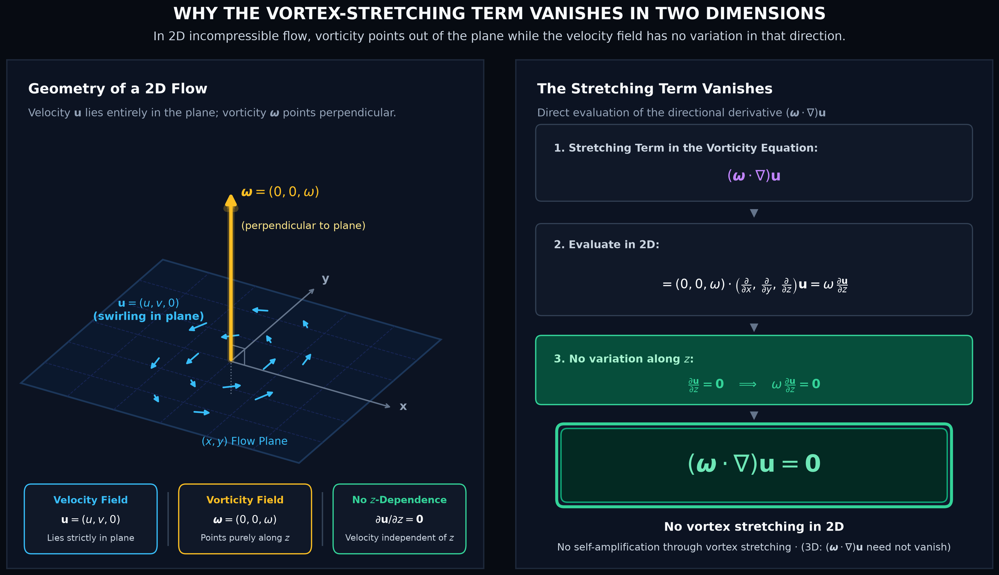
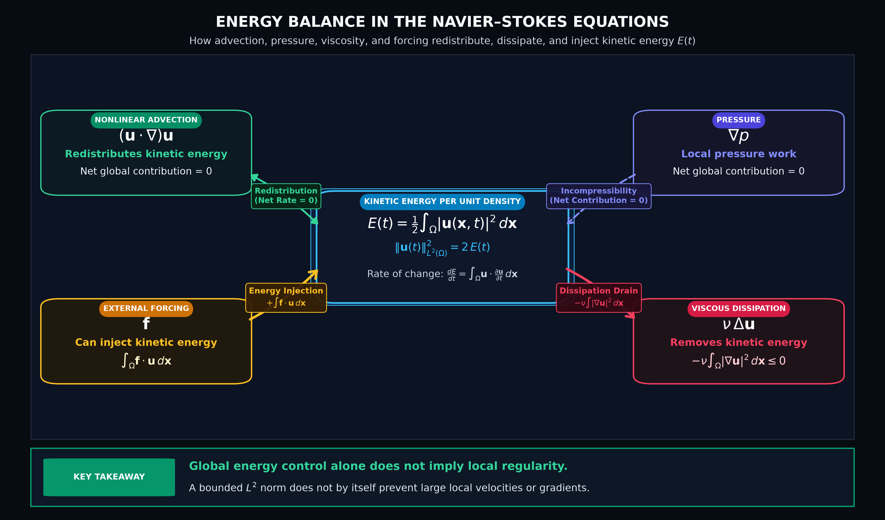
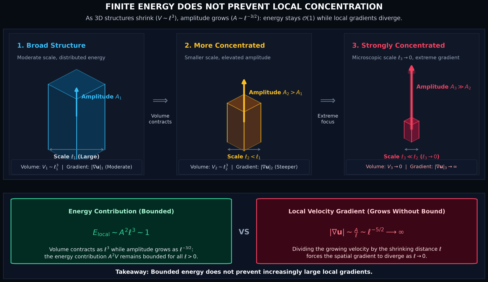
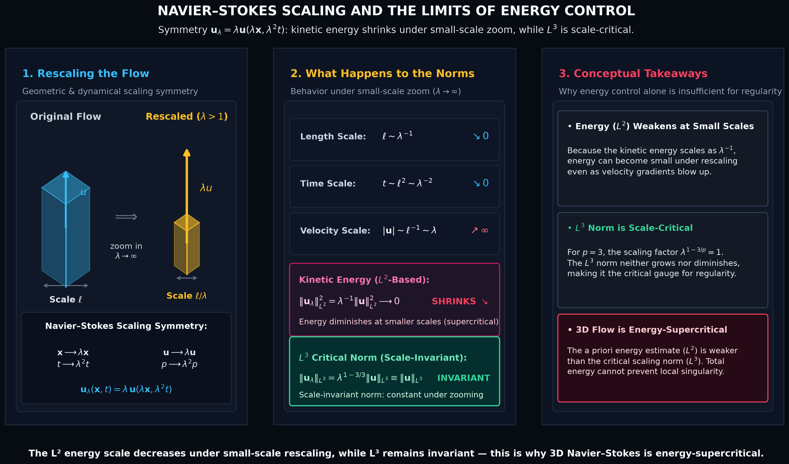
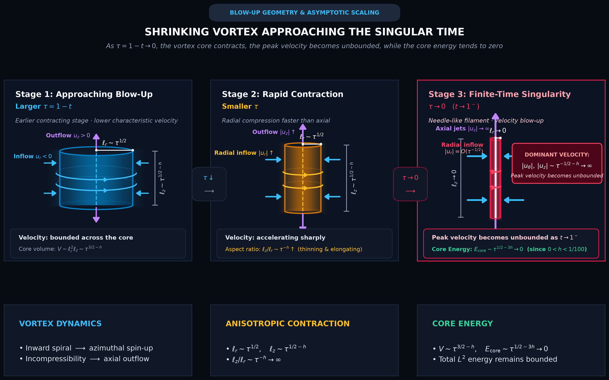

# Navier–Stokes Blow-Up: Fluid Regularity and Vortex Dynamics

This directory contains the standalone Python codebase and visualization suite supporting the technical article on **Navier–Stokes Blow-Up and Fluid Regularity**, published under **Stellar Priors**.

---

## 🗺️ Visual Architecture & Scientific Figures

The project provides self-contained, publication-grade scripts generating all 7 core scientific figures from first principles:

### 1. [Eulerian vs. Lagrangian Material Derivative](code/generate_material_derivative_infographic.py)

* **Kinematic Decomposition**: Decomposes the material derivative $\frac{D\mathbf{u}}{Dt} = \frac{\partial \mathbf{u}}{\partial t} + (\mathbf{u}\cdot\nabla)\mathbf{u}$ into local unsteady Eulerian rate of change and convective transport along fluid particle trajectories.
* **Observer Comparison**: Contrasts the fixed-probe Eulerian viewpoint against the moving fluid element Lagrangian frame traversing an accelerating contraction nozzle.
* **Script**: `code/generate_material_derivative_infographic.py`

---

### 2. [Vortex Stretching Mechanism in 3D](code/generate_vortex_stretching_infographic.py)

* **Nonlinear Amplification**: Details the positive-feedback mechanism governed by $(\boldsymbol{\omega}\cdot\nabla)\mathbf{u}$ in 3D incompressible flows.
* **Angular Momentum Conservation**: As velocity gradients stretch an aligned vortex filament along its axis ($L_1 \to L_2 > L_1$), mass conservation enforces radial core contraction ($R_1 \to R_2 < R_1$). By conservation of angular momentum / circulation $\Gamma$, vorticity intensifies quadratically with the radius reduction ($\omega \sim R^{-2}$).
* **Script**: `code/generate_vortex_stretching_infographic.py`

---

### 3. [Vanishing Vortex Stretching in 2D Flow](code/generate_vortex_stretching_2d_infographic.py)

* **Planar Regularity**: Rigorously demonstrates why 2D Navier–Stokes and Euler flows are globally regular for all time.
* **Orthogonal Decoupling**: For 2D planar velocity $\mathbf{u} = (u_x(x,y), u_y(x,y), 0)$, the vorticity vector is strictly perpendicular to the plane of motion: $\boldsymbol{\omega} = (0, 0, \omega_z(x,y))$. Consequently, $(\boldsymbol{\omega}\cdot\nabla)\mathbf{u} = \omega_z \frac{\partial \mathbf{u}}{\partial z} \equiv \mathbf{0}$, completely eliminating vortex stretching.
* **Script**: `code/generate_vortex_stretching_2d_infographic.py`

---

### 4. [Energy Balance and Viscous Dissipation](code/generate_energy_balance_infographic.py)

* **Global Energy Balance**: Illustrates how the momentum equation terms govern the rate of change of total kinetic energy $E(t) = \frac{1}{2}\int_{\Omega} |\mathbf{u}|^2 d\mathbf{x}$:
  $$\frac{dE}{dt} + \nu\int_{\Omega} |\nabla\mathbf{u}|^2\,d\mathbf{x} = \int_{\Omega} \mathbf{f}\cdot\mathbf{u}\,d\mathbf{x}$$
* **Role of Each Term**:
  * **Nonlinear Advection $(\mathbf{u}\cdot\nabla)\mathbf{u}$**: Purely redistributes kinetic energy across spatial scales and locations; its global integral vanishes identically ($\int_{\Omega} \mathbf{u}\cdot(\mathbf{u}\cdot\nabla)\mathbf{u}\,d\mathbf{x} = 0$).
  * **Pressure Gradient $\nabla p$**: Acts as an instantaneous Lagrange multiplier enforcing incompressibility $\nabla\cdot\mathbf{u} = 0$; performs zero net global work under periodic or no-slip boundary conditions ($\int_{\Omega} \mathbf{u}\cdot\nabla p\,d\mathbf{x} = 0$).
  * **Viscous Dissipation $\nu \Delta \mathbf{u}$**: Unconditionally acts as an energy dissipation sink, irreversibly converting kinetic energy into heat at rate $-\nu\int_{\Omega} |\nabla\mathbf{u}|^2 d\mathbf{x} \le 0$.
  * **External Forcing $\mathbf{f}$**: Serves as the sole mechanism for kinetic energy injection via power input $\int_{\Omega} \mathbf{f}\cdot\mathbf{u}\,d\mathbf{x}$.
* **Takeaway on Regularity**: Demonstrates why global $L^2$ energy control alone cannot prevent localized velocity concentration or finite-time gradient divergence.
* **Script**: `code/generate_energy_balance_infographic.py`

---

### 5. [Finite Kinetic Energy Concentration](code/generate_energy_concentration_infographic.py)

* **Leray Energy Inequality vs. Point Singularity**: Visualizes the geometric compatibility between bounded global kinetic energy $\frac{1}{2}\|\mathbf{u}(t)\|_{L^2}^2 \le E_0 < \infty$ and catastrophic velocity gradient blow-up $\|\nabla \mathbf{u}(t)\|_{L^2}^2 \to \infty$.
* **Shrinking Singular Shell**: A compact profile $u(r) = A e^{-(r/\sigma)^2}$ exhibits bounded total integral $\int |u|^2 dV \sim A^2 \sigma^3 = \text{const}$ while its spatial gradient scales as $\int |\nabla u|^2 dV \sim A^2 \sigma \sim \sigma^{-2} \to \infty$ as the core radius $\sigma \to 0$.
* **Script**: `code/generate_energy_concentration_infographic.py`

---

### 6. [Navier–Stokes Scaling Symmetries and Criticality](code/generate_scaling_limits_infographic.py)

* **Scale Invariance**: Explores the scaling transformation $\mathbf{u}_\lambda(x,t) = \lambda \mathbf{u}(\lambda x, \lambda^2 t)$ that preserves the unforced Navier–Stokes system.
* **Subcritical vs. Supercritical Regimes**: Maps Lebesgue spaces $L^p(\mathbb{R}^3)$:
  * **$L^2$ Kinetic Energy**: Scaled norm $\|\mathbf{u}_\lambda\|_{L^2} = \lambda^{-1/2}\|\mathbf{u}\|_{L^2} \to 0$ as $\lambda \to \infty$ (Supercritical — energy cannot prevent small-scale concentration).
  * **$L^3$ Critical Space**: Scaled norm $\|\mathbf{u}_\lambda\|_{L^3} = \lambda^0 \|\mathbf{u}\|_{L^3}$ (Scale invariant — the Ladyzhenskaya / Escauriaza-Seregin-Šverák critical regularity threshold).
  * **$L^\infty$ Peak Velocity**: Scaled norm $\|\mathbf{u}_\lambda\|_{L^\infty} = \lambda^1 \|\mathbf{u}\|_{L^\infty} \to \infty$ (Subcritical).
* **Script**: `code/generate_scaling_limits_infographic.py`

---

### 7. [Shrinking Vortex Ring & Singularity Formation](code/generate_shrinking_vortex_infographic.py)

* **Dynamic Core Contraction**: Visualizes the finite-time blow-up mechanism where an intense vortex ring undergoes self-induced azimuthal stretching and anisotropic core collapse.
* **Beale–Kato–Majda Condition**: Illustrates the divergence of peak enstrophy $\Omega(t) = \|\boldsymbol{\omega}(t)\|_{L^\infty} \sim (T^*-t)^{-1}$ and total strain rate along the vortex core as $t \to T^*$.
* **Script**: `code/generate_shrinking_vortex_infographic.py`

---

## 💻 Installation & Dependencies

The visualization suite requires Python 3.9+ with standard scientific libraries:

```bash
# Clone the repository and navigate to the project directory
cd navier_stokes_blow_up

# Create and activate a clean virtual environment
python3 -m venv venv
source venv/bin/activate

# Install required dependencies
pip install -r requirements.txt
```

### Dependencies
* `numpy >= 1.24.0`: Vectorized fluid fields and coordinate transformations
* `scipy >= 1.10.0`: Special functions and numerical integration
* `matplotlib >= 3.7.0`: Vector and raster publication graphics rendering
* `pillow >= 9.5.0`: Image processing and metadata verification
* `pytest >= 7.0.0`: Automated test execution

---

## 🚀 Usage

### Generate All Scientific Figures
To re-render all 7 high-resolution publication figures into `images/`:

```bash
python3 code/generate_all_figures.py
```

### Generate Figures Individually
Each script is completely self-contained and accepts an optional `--output` flag:

```bash
python3 code/generate_material_derivative_infographic.py
python3 code/generate_vortex_stretching_infographic.py
python3 code/generate_vortex_stretching_2d_infographic.py
python3 code/generate_energy_balance_infographic.py
python3 code/generate_energy_concentration_infographic.py
python3 code/generate_scaling_limits_infographic.py
python3 code/generate_shrinking_vortex_infographic.py
```

---

## 🧪 Running the Test Suite

A comprehensive test suite validates both the fluid mechanical formulations and the figure generation pipeline:

```bash
# Run using standard library unittest
python3 -m unittest tests/test_figure_generation.py

# Or run using pytest
pytest tests/ -v
```

The test suite validates:
1. **Material Derivative Kinematics**: Exact balance between total, local, and advective acceleration in 1D/2D nozzle flows.
2. **2D Vortex Stretching Invariance**: Machine-precision cancellation $(\boldsymbol{\omega}\cdot\nabla)\mathbf{u} = 0$ for arbitrary planar vector fields.
3. **Scaling Critical Exponents**: Lebesgue norm scaling $\|\mathbf{u}_\lambda\|_{L^p} = \lambda^{1 - 3/p} \|\mathbf{u}\|_{L^p}$ across dimension $d=3$.
4. **Rendering Integrity**: Isolated generation of all 7 figures in temporary workspaces, confirming PNG magic headers, non-zero file sizes (> 40 KB), and minimum resolution requirements.

---

## 📚 References & Further Reading

1. **Leray, J. (1934).** *Sur le mouvement d’un liquide visqueux emplissant l’espace.* Acta Mathematica, 63, 193–248. [10.1007/BF02547354](https://doi.org/10.1007/BF02547354) · [Springer](https://link.springer.com/article/10.1007/BF02547354).
2. **Caffarelli, L., Kohn, R., & Nirenberg, L. (1982).** *Partial regularity of suitable weak solutions of the Navier–Stokes equations.* Communications on Pure and Applied Mathematics, 35(6), 771–831. [10.1002/cpa.3160350604](https://doi.org/10.1002/cpa.3160350604) · [Wiley](https://onlinelibrary.wiley.com/doi/10.1002/cpa.3160350604).
3. **Escauriaza, L., Seregin, G. A., & Šverák, V. (2003).** *L³,∞-solutions of the Navier–Stokes equations and backward uniqueness.* Russian Mathematical Surveys, 58(2), 211–250. [10.1070/RM2003v058n02ABEH000609](https://doi.org/10.1070/RM2003v058n02ABEH000609) · [IOPscience](https://iopscience.iop.org/article/10.1070/RM2003v058n02ABEH000609).
4. **Fefferman, C. L. (2006).** *Existence and Smoothness of the Navier–Stokes Equation.* In J. Carlson, A. Jaffe & A. Wiles (Eds.), *The Millennium Prize Problems*, 57–67. Clay Mathematics Institute / American Mathematical Society. [Official Clay PDF](https://www.claymath.org/wp-content/uploads/2022/06/navierstokes.pdf).
5. **Tao, T. (2016).** *Finite time blowup for an averaged three-dimensional Navier–Stokes equation.* Journal of the American Mathematical Society, 29(3), 601–674. [10.1090/jams/838](https://doi.org/10.1090/jams/838) · [arXiv:1402.0290](https://arxiv.org/abs/1402.0290).
6. **OpenAI. (2026).** *On the Navier–Stokes Millennium Prize Problem.* OpenAI Research, 8 September 2026. [OpenAI Research Announcement](https://openai.com/index/navier-stokes-solution/).
7. **OpenAI. (2026).** *Finite Time Blowup for Navier–Stokes.* Research preprint, September 2026. [OpenAI Proof PDF](https://cdn.openai.com/pdf/32d9f210-8b73-45e0-91bc-82a30aef8a9a/navier-stokes.pdf).
8. **Clay Mathematics Institute. (2026).** *Navier–Stokes Announcement.* 11 September 2026. [Clay Mathematics Institute Announcement](https://www.claymath.org/news/navier-stokes-announcement/).

---

## 📄 License

This project is licensed under the MIT License - see the [LICENSE](../LICENSE) file for details.
