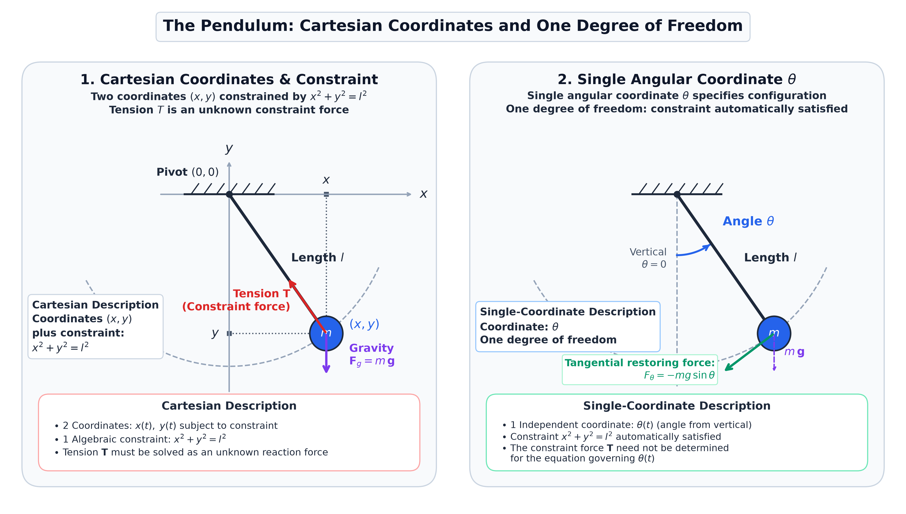
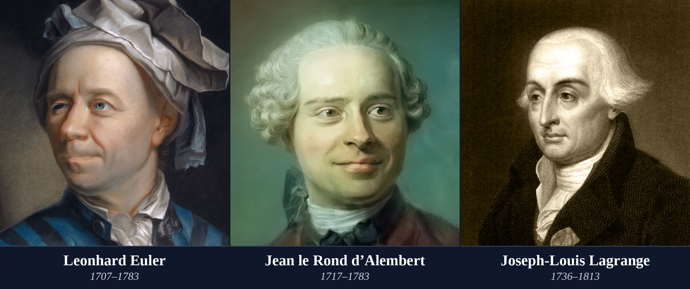
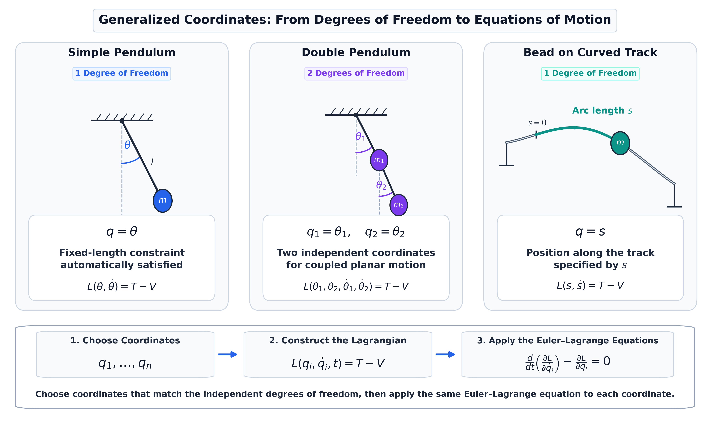
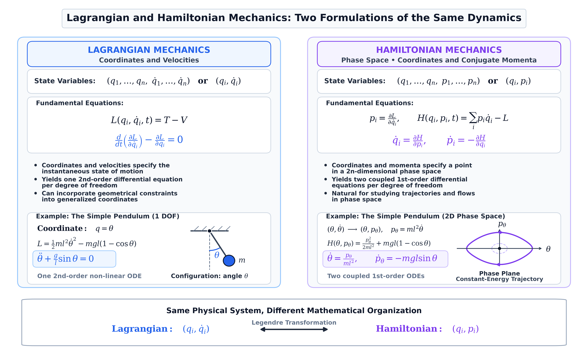
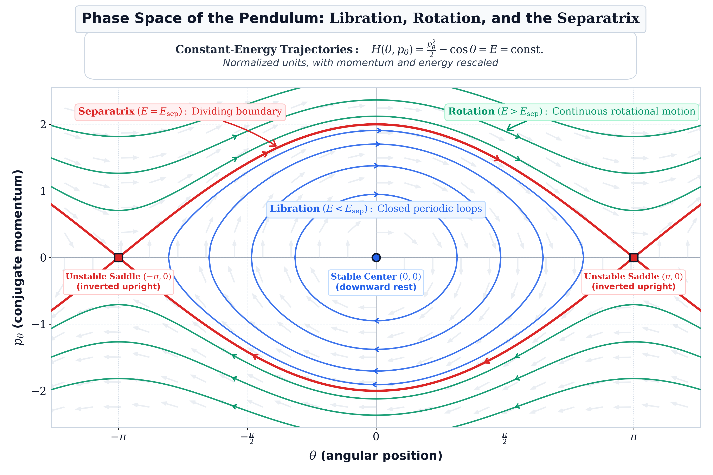
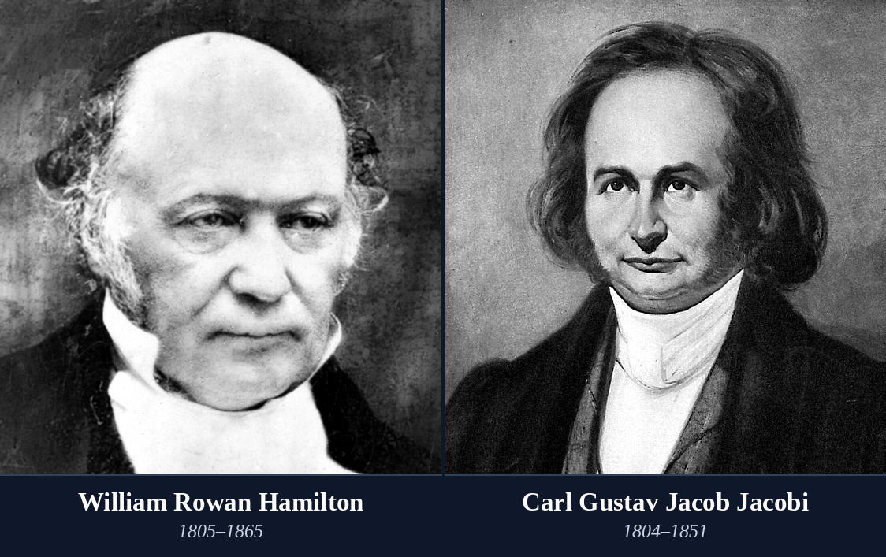

# From Newton to Hamilton: The Road to Modern Dynamics

This directory contains the standalone Python codebase and visualization suite supporting the technical article on **From Newton to Hamilton: The Road to Modern Dynamics**, published under **Stellar Priors**.

---

## 🌌 Overview & Physical Architecture

Classical mechanics began as a theory of forces and accelerations in Euclidean space governed by Newton's second law $\mathbf{F} = m\mathbf{a}$. While effective for unconstrained two-body celestial motion, Newtonian mechanics becomes cumbersome when applied to coupled systems with geometric constraints or many interacting bodies.

This project reconstructs the mathematical and conceptual journey that transformed mechanics over two centuries:
1. **The Newtonian Challenge & Constraints**: Newtonian forces require solving coupled differential equations simultaneously with algebraic constraint equations and explicit constraint forces (such as tension $T$).
2. **Lagrangian Analytical Mechanics (1788)**: Eliminates constraint forces entirely by mapping configurations to a manifold $Q$ parameterized by generalized coordinates $q = (q_1, \dots, q_n)$. Motion is governed by the principle of stationary action $\delta \int L\,dt = 0$, producing $n$ second-order Euler–Lagrange equations.
3. **Hamiltonian Phase Space (1834–1835)**: Replaces velocities with generalized momenta $p_i = \partial L / \partial \dot{q}_i$ via the Legendre transformation (originating in [Legendre’s 1787 memoir](https://books.google.com/books?id=XvNkAAAAcAAJ&pg=PA309)) $H(q, p) = \sum p_i \dot{q}_i - L$. Configuration space $TQ$ is replaced by phase space $T^*Q$, converting $n$ second-order equations into $2n$ first-order symmetric canonical equations:
   $$\dot{q}_i = \frac{\partial H}{\partial p_i}, \qquad \dot{p}_i = -\frac{\partial H}{\partial q_i}$$
4. **Hamilton–Jacobi Theory & Wavefronts**: Hamilton's optical-mechanical analogy connects particle paths with rays perpendicular to action surfaces, leading to canonical transformations and Jacobi's complete solutions.
5. **The Bridge to Modern Qualitative Dynamics**: Paves the foundation for Poincaré's geometric revolution in the three-body problem—studying global phase-space topology, invariant manifolds, and stability rather than relying on elusive explicit formulas.

---

## 📊 Scientific Figure Gallery

### 1. [Pendulum Coordinate Transition: Constraints to Degrees of Freedom](code/generate_pendulum_coordinate_transition.py)

* **Panel 1 (Cartesian Coordinates with Constraint)**:
  * Bob position described by two variables $(x, y)$ subject to the algebraic holonomic constraint $x^2 + y^2 = l^2$.
  * Newton's second law requires explicit determination of the constraint force (tension $\mathbf{T}$).
* **Panel 2 (Generalized Coordinate)**:
  * Motion parameterized by a single unconstrained generalized coordinate $q = \theta$.
  * Automatically satisfies the fixed-length constraint and eliminates internal tension forces from the equations of motion.
* **Script**: `code/generate_pendulum_coordinate_transition.py`

---

### 2. [The Pioneers of Analytical Mechanics](code/generate_analytical_mechanics_portraits.py)

* **Historical Portrait Panel**:
  * **Leonhard Euler (1707–1783)**: Formulated the calculus of variations and the foundational equations of rigid body and fluid dynamics (*Mechanica*, 1736).
  * **Jean le Rond d'Alembert (1717–1783)**: Formulated the principle of virtual work, treating dynamical problems as static equilibrium problems (*Traité de dynamique*, 1743).
  * **Joseph-Louis Lagrange (1736–1813)**: Synthesized mechanics into an entirely analytical framework without geometric diagrams (*Mécanique analytique*, 1788).
* **Script**: `code/generate_analytical_mechanics_portraits.py`

---

### 3. [Generalized Coordinates & Degrees of Freedom](code/generate_generalized_coordinates.py)

* **Multi-System Structural Taxonomy**:
  * **Simple Pendulum**: 1 Degree of Freedom, configuration space $S^1$, generalized coordinate $\theta$.
  * **Double Pendulum**: 2 Degrees of Freedom, configuration space $T^2 = S^1 \times S^1$, coordinates $(\theta_1, \theta_2)$.
  * **Bead on Curved Wire**: 1 Degree of Freedom, 1D spatial curve embedded in $\mathbb{R}^3$, coordinate arc-length $s$.
* **Analytical Pipeline**: Maps configuration space $Q$ directly into the Lagrangian $L(q, \dot{q}, t) = T - V$ and the Euler–Lagrange equations.
* **Script**: `code/generate_generalized_coordinates.py`

---

### 4. [Lagrangian vs. Hamiltonian Mechanics](code/generate_lagrange_vs_hamilton_comparison.py)

* **Two Formulations of Classical Dynamics**:
  * **Lagrangian Formulation**: Configuration space $(q, \dot{q}) \in TQ$, $n$ second-order differential equations, variational principle of stationary action, naturally suited for holonomic constraints.
  * **Hamiltonian Formulation**: Phase space $(q, p) \in T^*Q$, $2n$ first-order symmetric canonical equations, Legendre transformation $H(q, p) = \sum p\dot{q} - L$
* **Script**: `code/generate_lagrange_vs_hamilton_comparison.py`

---

### 5. [Phase Space of the Nonlinear Pendulum](code/generate_pendulum_phase_portrait.py)

* **Global Phase Space Geometry $(\theta, p_\theta)$**:
  * **Libration Regime ($E < 2mgl$)**: Nested closed orbits circulating around the stable center equilibrium $(\theta = 0, p_\theta = 0)$.
  * **Homoclinic Separatrix ($E = 2mgl$)**: The critical figure-eight boundary connecting the unstable saddle equilibria at $\theta = \pm\pi$, with analytical momentum profile $p_\theta = \pm 2ml^2\omega_0\cos(\theta/2)$.
  * **Rotation Regime ($E > 2mgl$)**: Open undulating wave-like trajectories flowing continuously across angle boundaries.
* **Script**: `code/generate_pendulum_phase_portrait.py`

---

### 6. [Masters of Canonical Dynamics](code/generate_hamilton_jacobi_portraits.py)

* **Historical Portrait Panel**:
  * **Sir William Rowan Hamilton (1805–1865)**: Introduced the characteristic function, canonical equations, and the optical-mechanical wave-ray duality (1834–1835).
  * **Carl Gustav Jacob Jacobi (1804–1851)**: Developed canonical transformation theory and the Hamilton–Jacobi partial differential equation (*Vorlesungen über Dynamik*, 1866).
* **Script**: `code/generate_hamilton_jacobi_portraits.py`

---

## 📁 Directory Structure

```
the_road_to_modern_dynamics/
├── README.md                                 # Comprehensive documentation & figure gallery
├── requirements.txt                          # Python dependencies
├── images/                                   # Pre-rendered high-res publication figures
│   ├── pendulum_coordinate_transition.png
│   ├── analytical_mechanics_portraits.png
│   ├── generalized_coordinates.png
│   ├── lagrange_vs_hamilton_comparison.png
│   ├── pendulum_phase_portrait.png
│   └── hamilton_jacobi_portraits.png
├── code/                                     # Standalone, runnable generation scripts
│   ├── generate_pendulum_coordinate_transition.py
│   ├── generate_analytical_mechanics_portraits.py
│   ├── generate_generalized_coordinates.py
│   ├── generate_lagrange_vs_hamilton_comparison.py
│   ├── generate_pendulum_phase_portrait.py
│   ├── generate_hamilton_jacobi_portraits.py
│   └── generate_all_figures.py               # Master batch runner
└── tests/                                    # Automated test suite
    ├── __init__.py
    └── test_figure_generation.py             # Numerical physics and rendering integrity tests
```

---

## 💻 Installation & Dependencies

The visualization suite requires Python 3.9+ with standard scientific libraries:

```bash
# Clone the repository and navigate to the project directory
cd the_road_to_modern_dynamics

# Create and activate a clean virtual environment
python3 -m venv venv
source venv/bin/activate

# Install required dependencies
pip install -r requirements.txt
```

### Dependencies
* `numpy >= 1.22.0`: Numerical evaluation of trajectories, energy surfaces, and vector arrays
* `scipy >= 1.8.0`: ODE integration and elliptic functions
* `matplotlib >= 3.5.0`: Scientific plotting, mathtext rendering, and vector graphics
* `pillow >= 9.0.0`: Image raster compositing, typography rendering, and format verification
* `pytest >= 7.0.0`: Automated unit test runner

---

## 🚀 Usage

### Generate All Scientific Figures
To re-render all 6 high-resolution publication figures into `images/`:

```bash
python3 code/generate_all_figures.py
```

### Generate Figures Individually
Each script is completely self-contained and accepts an optional output path:

```bash
python3 code/generate_pendulum_coordinate_transition.py
python3 code/generate_analytical_mechanics_portraits.py
python3 code/generate_generalized_coordinates.py
python3 code/generate_lagrange_vs_hamilton_comparison.py
python3 code/generate_pendulum_phase_portrait.py
python3 code/generate_hamilton_jacobi_portraits.py
```

---

## 🧪 Running the Test Suite

A comprehensive test suite validates both the physical and mathematical formulations and the rendering integrity:

```bash
# Run using standard library unittest
python3 -m unittest tests/test_figure_generation.py

# Or run using pytest
pytest tests/ -v
```

The test suite validates:
1. **Holonomic Degrees of Freedom**: Verified formula $d = 3N - k$ across simple pendulums, double pendulums, and constrained curve geometries.
2. **Legendre Transformation**: Exact equality between the Legendre transform $H = \sum p\dot{q} - L$ and the total energy $E = T + V$ across arbitrary state spaces.
3. **Canonical Equations of Motion**: Verified that $\dot{q} = \partial H/\partial p$ and $\dot{p} = -\partial H/\partial q$ recover the exact second-order nonlinear pendulum differential equation.
4. **Phase Space Energy & Separatrix**: Strict conservation of saddle energy $E = 2mgl$ along the analytical separatrix profile $p(\theta) = \pm 2ml^2\omega_0\cos(\theta/2)$.
5. **Symplectic Energy Conservation**: Verified that the Poisson bracket / flow derivative $dH/dt \equiv 0$ vanishes identically.
6. **Rendering Integrity**: Isolated generation of all 6 publication figures into temporary workspaces, confirming valid PNG magic headers, non-zero file sizes (> 30 KB), and minimum resolution requirements.

---

## 📚 References & Historical Sources

1. **Newton, I. (1687).** *Philosophiæ Naturalis Principia Mathematica.* London: Joseph Streater for the Royal Society. [Digital copy: Google Books](https://books.google.com/books/about/Philosophiae_naturalis_principia_mathema.html?id=-dVKAQAAIAAJ)
2. **Euler, L. (1736).** *Mechanica sive Motus Scientia Analytice Exposita.* St Petersburg: Academia Scientiarum, 2 vols. [Digital edition: ETH Zürich, e-rara](https://www.e-rara.ch/zut/content/titleinfo/6444711)
3. **d’Alembert, J. le R. (1743).** *Traité de dynamique, dans lequel les lois de l’équilibre et du mouvement des corps sont réduites au plus petit nombre possible.* Paris: David l’aîné. [Digital copy: Google Books](https://books.google.com/books/about/Trait%C3%A9_de_dynamique.html?id=2gciZSWqdEQC)
4. **Maupertuis, P.-L. M. de (1744).** *Accord de différentes loix de la nature qui avoient jusqu’ici paru incompatibles.* Mémoires de l’Académie Royale des Sciences de Paris, 417–426. [Digital text: Wikisource](https://fr.wikisource.org/wiki/Accord_de_diff%C3%A9rentes_loix_de_la_nature_qui_avoient_jusqu%E2%80%99ici_paru_incompatibles)
5. **Lagrange, J.-L. (1788).** *Mécanique analytique.* Paris: Desaint. [Digital edition: Open Library](https://openlibrary.org/works/OL1794115W/Me%CC%81canique_analytique)
6. **Legendre, A.-M. (1789).** *Mémoire sur l’intégration de quelques équations aux différences partielles.* Mémoires de l’Académie Royale des Sciences (Année 1787), 309–351. Read 1 September 1787. [Digital copy: Google Books](https://books.google.com/books?id=XvNkAAAAcAAJ&pg=PA309)
7. **Hamilton, W. R. (1828).** *Theory of Systems of Rays.* Transactions of the Royal Irish Academy, 15, 69–174. [Original paper: Trinity College Dublin](https://www.maths.tcd.ie/pub/HistMath/People/Hamilton/Rays/PtFst.pdf)
8. **Hamilton, W. R. (1834).** *On a General Method in Dynamics; by which the Study of the Motions of all Free Systems of Attracting or Repelling Points is Reduced to the Search and Differentiation of One Central Relation, or Characteristic Function.* Philosophical Transactions of the Royal Society of London, 124, 247–308. [Original paper: Trinity College Dublin](https://www.maths.tcd.ie/pub/HistMath/People/Hamilton/Dynamics/GenMeth.pdf)
9. **Hamilton, W. R. (1835).** *Second Essay on a General Method in Dynamics.* Philosophical Transactions of the Royal Society of London, 125, 95–144. [Hamilton’s mathematical papers: Trinity College Dublin](https://www.maths.tcd.ie/pub/HistMath/People/Hamilton/Papers.html)
10. **Jacobi, C. G. J. (1866).** *Vorlesungen über Dynamik.* Edited by A. Clebsch. Berlin: G. Reimer. [Digital edition: Open Library](https://openlibrary.org/books/OL23357563M/Vorlesungen_%C3%BCber_Dynamik_nebst_f%C3%BCnf_hinterlassenen_Abhandlungen_desselben_hrsg._von_A._Clebsch.)
11. **Whittaker, E. T. (1904).** *A Treatise on the Analytical Dynamics of Particles and Rigid Bodies, with an Introduction to the Problem of Three Bodies.* Cambridge University Press. [Digital edition: Open Library](https://openlibrary.org/books/OL22211125M/A_treatise_on_the_analytical_dynamics_of_particles_and_rigid_bodies)
12. **Lanczos, C. (1949).** *The Variational Principles of Mechanics.* University of Toronto Press. [Publisher record: De Gruyter Brill](https://www.degruyterbrill.com/document/doi/10.3138/9781487583057/html)
13. **Goldstein, H., Poole, C. P., & Safko, J. L. (2002).** *Classical Mechanics*, 3rd ed. Addison-Wesley. [Publisher information: Pearson](https://www.pearson.com/en-us/subject-catalog/p/Goldstein-Classical-Mechanics-3rd-Edition/P200000006871)

---

## 📄 License

This project is licensed under the MIT License - see the [LICENSE](../LICENSE) file for details.
