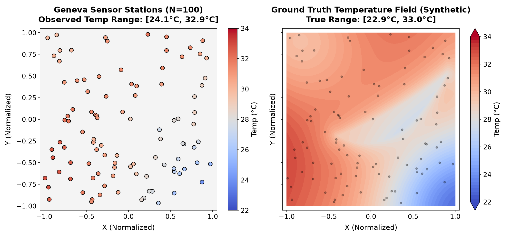
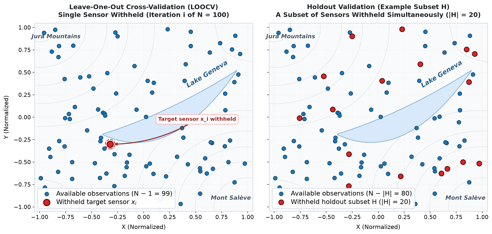
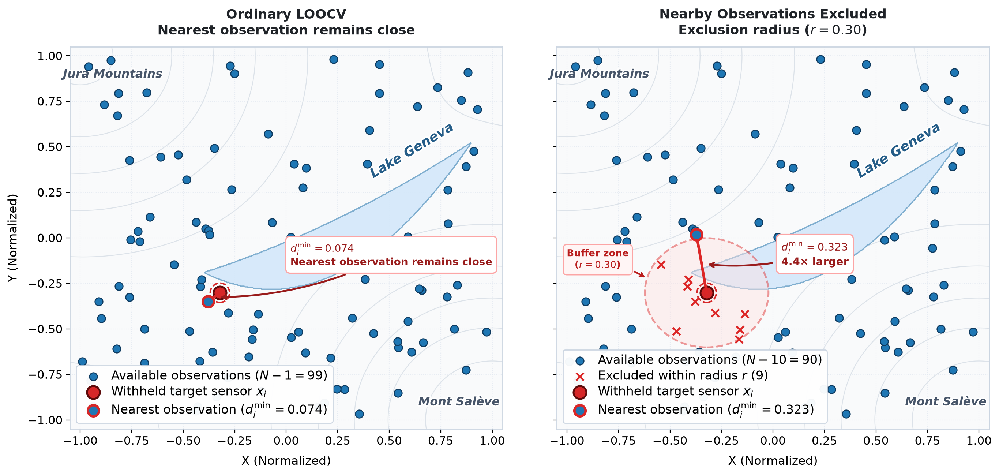
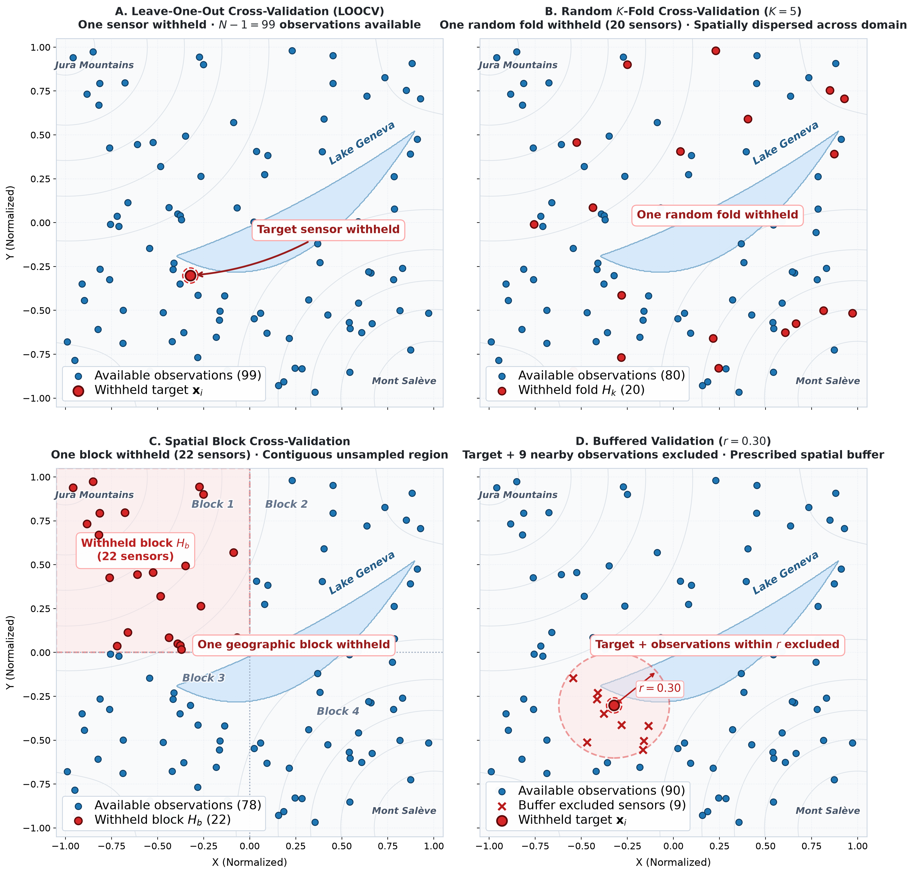
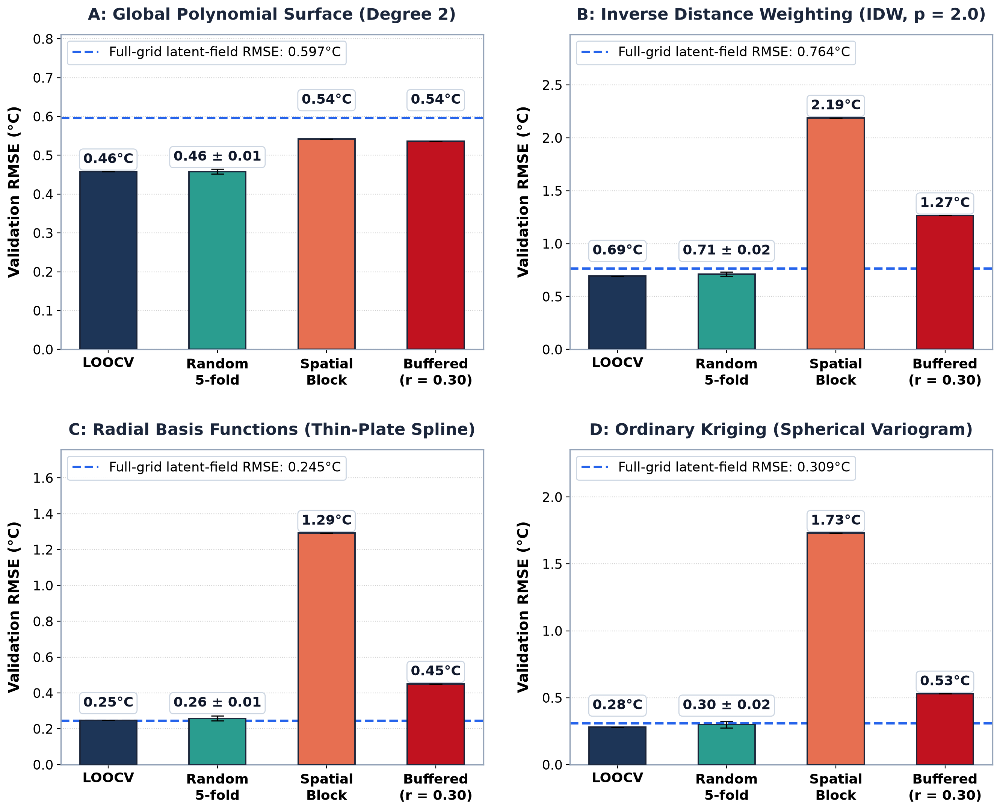
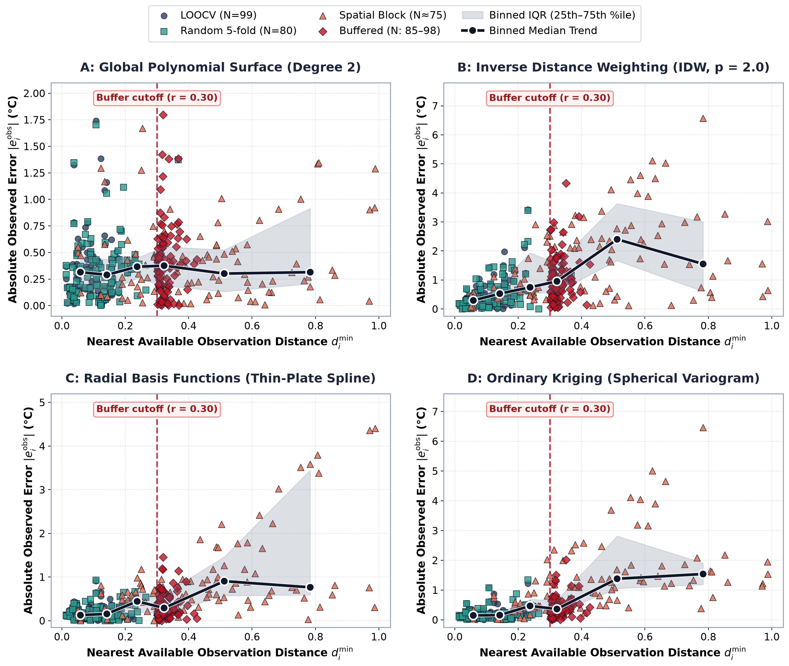

# Validating Spatial Interpolation: Beyond LOOCV

This directory contains the standalone Python codebase, data, and visualization suite supporting the technical article on **Validating Spatial Interpolation: Beyond LOOCV — How spatial sampling changes what interpolation accuracy really means**, published under **Stellar Priors**.

The project provides first-principles implementations of spatial interpolation models, rigorous spatial cross-validation protocols, empirical semivariogram modeling, and the complete data pipeline required to reproduce all benchmark calculations and publication figures.

---

## 🗺️ Visual Architecture & Scientific Figures

The project includes modular, self-contained scripts generating high-resolution scientific figures from first principles:

### 1. [Ground Truth Microclimate & Sensor Network](images/geneva_baseline_comparison.png)

* **Synthetic Geneva Microclimate**: Simulates a high-resolution temperature field across the Geneva basin ($X, Y \in [-1, 1]$) incorporating regional macro-cooling, adiabatic lapse rate elevation cooling (Jura and Salève massifs), shoreline lake breeze effects, and an unsampled physical void over Lake Geneva (*Lac Léman*).
* **Observation Network**: 100 irregularly distributed sensor stations with instrument noise ($\sigma = 0.15^\circ\text{C}$).
* **Data File**: `data/sensors_data.csv`

---

### 2. [Validation Schemes: LOOCV vs. Spatial Blocking](code/generate_validation_schemes_plot.py)

* **The Autocorrelation Problem**: In standard Leave-One-Out Cross-Validation (LOOCV), withholding a single sensor leaves nearby neighbors intact ($\min d \approx 0.08$), measuring only local fill-in ability.
* **Spatial Block Holdout**: By withholding an entire contiguous quadrant ($X > 0, Y < 0$), test sensors are separated from the training set by a wide spatial gap ($\min d \gg 0.30$), forcing models to perform true spatial extrapolation.
* **Script**: `code/generate_validation_schemes_plot.py`

---

### 3. [Spatial Gap & Buffered Cross-Validation](code/generate_spatial_gap_plot.py)

* **Buffered LOOCV**: Systematically excludes all observations within an Euclidean exclusion radius $r$ of the withheld target sensor ($r \in [0.05, 0.35]$).
* **Information Horizon**: Demonstrates how severing spatial autocorrelation reveals the true generalization breakdown distance for local versus global interpolation methods.
* **Script**: `code/generate_spatial_gap_plot.py`

---

### 4. [Spatial Sampling Strategies Comparison](code/generate_sampling_strategies_plot.py)

* **Point Process Topology**: Compares four distinct sensor deployment regimes:
  1. **Uniform Random**: Baseline homogeneous Poisson spatial distribution.
  2. **Clustered Sampling**: Dense urban clusters with vast rural voids (e.g., opportunistic citizen-science networks).
  3. **Transect / Route**: Highly localized 1D linear sensor transects along transit corridors.
  4. **Regular Grid**: Uniformly spaced sensor lattice maximizing spatial coverage.
* **Script**: `code/generate_sampling_strategies_plot.py`

---

### 5. [Validation Benchmark RMSE Across Regimes](code/generate_benchmark_plots.py)

* **Method Performance Shift**: While local flexible models (Thin-Plate Splines, Kriging) dominate under standard LOOCV ($\text{RMSE} \approx 0.25^\circ\text{C}$), their errors surge under Spatial Blocking ($\text{RMSE} > 1.2^\circ\text{C}$), where smooth low-order polynomial surfaces exhibit superior structural stability.
* **Script**: `code/generate_benchmark_plots.py`

---

### 6. [Interpolation Error as a Function of Distance](code/generate_benchmark_plots.py)

* **Empirical Error Degradation**: Quantifies test RMSE as a direct function of distance to the nearest available training observation $d_{\min}$, tracing the inflection point where local kernels degenerate toward the global dataset mean.
* **Script**: `code/generate_benchmark_plots.py`

---

### Accompanying Syntheses & Topography
* **Table 1**: Full cross-validation benchmark matrix across validation regimes (`images/table_1.png`).
* **Table 2**: Sampling strategy sensitivity and spatial autocorrelation breakdown (`images/table_2.png`).
* **Topography**: Digital elevation model of the Geneva basin (`images/geneva_topography.png`).

---

## 📐 Mathematical Models & First-Principles Solvers

All spatial interpolators in `code/solvers.py` are built in pure **NumPy** and **SciPy**, free of black-box machine learning dependencies:

### 1. Bivariate Polynomial Surface
Fits a global 2D degree-$d$ polynomial surface via ordinary least squares:
$$f(x, y) = \sum_{i+j \le d} c_{ij} x^i y^j, \quad \mathbf{c} = (\mathbf{A}^T \mathbf{A})^{-1} \mathbf{A}^T \mathbf{z}$$

### 2. Inverse Distance Weighting (IDW)
Computes a distance-weighted neighborhood average with Shepard power $p=2$:
$$f(x, y) = \frac{\sum_{i=1}^n w_i z_i}{\sum_{i=1}^n w_i}, \quad w_i = \frac{1}{\|\mathbf{x} - \mathbf{x}_i\|^p}$$
*Exact training point coincidence ($\|\mathbf{x} - \mathbf{x}_i\| = 0$) is handled analytically to prevent division by zero.*

### 3. Radial Basis Functions (RBF - Thin-Plate Spline)
Solves a conditionally positive definite kernel system with linear polynomial drift:
$$f(\mathbf{x}) = \sum_{i=1}^n w_i \phi(\|\mathbf{x} - \mathbf{x}_i\|) + a_0 + a_1 x + a_2 y$$
where $\phi(r) = r^2 \ln(r)$, subject to the spatial equilibrium constraints $\sum w_i = 0$, $\sum w_i x_i = 0$, $\sum w_i y_i = 0$.

### 4. Ordinary Kriging
Constructs the Best Linear Unbiased Estimator (BLUE) via empirical semivariance binning:
$$\hat{\gamma}(h) = \frac{1}{2 |N(h)|} \sum_{(i, j) \in N(h)} (z_i - z_j)^2$$
Fits a parametric spherical semivariogram with nugget $c_0$, partial sill $c$, and range $a$:
$$\gamma(h) = \begin{cases} c_0 + c \left( \frac{3h}{2a} - \frac{h^3}{2a^3} \right), & 0 < h \le a \\ c_0 + c, & h > a \end{cases}$$
and solves the augmented Kriging matrix system with Lagrange multiplier $\mu$ enforcing $\sum w_i = 1$.

---

## 🚀 Getting Started

### 📋 Prerequisites

Clone the repository and install the required dependencies:

```bash
# From repository root
pip install -r validating_spatial_interpolation/requirements.txt

# Or inside this project directory
pip install -r requirements.txt
```

Key dependencies: `numpy>=1.22.0`, `scipy>=1.8.0`, `matplotlib>=3.5.0`, `pillow>=9.0.0`, `pytest>=7.0.0`.

---

## 🔬 Reproducing Calculations & Benchmarks

### 1. Run the Full Validation Benchmark
Executes the complete experimental suite across all 4 validation regimes (LOOCV, Random 5-Fold, Spatial Block CV, and Buffered CV for $r \in [0.05, 0.35]$) across all 4 spatial models:

```bash
python3 code/run_validation_benchmark.py
```

*The benchmark evaluates 304 Ordinary Kriging semivariogram inversions in under 8 seconds and caches all metrics into `data/benchmark_results.json`.*

### 2. Generate All Publication Figures
Re-renders all high-resolution publication figures into `images/`:

```bash
python3 code/generate_all_figures.py
```

Or run individual figure generators:
```bash
python3 code/generate_validation_schemes_plot.py
python3 code/generate_spatial_gap_plot.py
python3 code/generate_sampling_strategies_plot.py
python3 code/generate_benchmark_plots.py
```

---

## 🧪 Running the Test Suite

A comprehensive 23-test suite validates the data generator, sensor integrity, spatial solvers, cross-validation partitioning, and figure generation pipeline:

```bash
# Run using standard library unittest
python3 -m unittest discover -s tests -v

# Or run using pytest
pytest tests/ -v
```

### Test Coverage Highlights:
* **`test_data_generator.py`**: Topographic lapse rate, lake geometry boundary tests, sensor coordinate bounds, and physical lake exclusion verification.
* **`test_solvers.py`**: Exact quadratic recovery for polynomial surfaces, IDW exact coincidence and midpoint symmetry, Thin-Plate Spline interpolation and drift constraints, spherical semivariogram asymptotic properties, and Kriging matrix stability.
* **`test_validation_schemes.py`**: LOOCV sample masking, 5-fold cross-validation orthogonality and seed reproducibility, 4-quadrant spatial blocking completeness, buffered exclusion radius guarantee ($d_{\min} > r$), and metric parity with `benchmark_results.json`.
* **`test_image_generation.py`**: Execution and non-trivial resolution and header integrity checks for all generated PNG figures.

---

## 📊 Summary of Benchmark Results

Below are the quantitative cross-validation results reproduced by `code/run_validation_benchmark.py`:

| Model | Ground Truth RMSE | LOOCV RMSE | Random 5-Fold RMSE | Spatial Block RMSE | Buffered ($r=0.30$) RMSE |
| :--- | :---: | :---: | :---: | :---: | :---: |
| **Polynomial (Deg 2)** | $0.573^\circ\text{C}$ | $0.458^\circ\text{C}$ | $0.468^\circ\text{C}$ | **$0.542^\circ\text{C}$** | $0.536^\circ\text{C}$ |
| **IDW ($p=2$)** | $0.569^\circ\text{C}$ | $0.693^\circ\text{C}$ | $0.692^\circ\text{C}$ | $2.189^\circ\text{C}$ | $1.266^\circ\text{C}$ |
| **RBF (Thin-Plate)** | **$0.332^\circ\text{C}$** | **$0.247^\circ\text{C}$** | **$0.247^\circ\text{C}$** | $1.292^\circ\text{C}$ | **$0.451^\circ\text{C}$** |
| **Ordinary Kriging** | $0.354^\circ\text{C}$ | $0.279^\circ\text{C}$ | $0.276^\circ\text{C}$ | $1.731^\circ\text{C}$ | $0.530^\circ\text{C}$ |

### Key Takeaway:
* **The Validation Trap**: Standard random CV or LOOCV severely underestimates out-of-sample error for local models in sparse domains. RBF achieves a stellar $0.247^\circ\text{C}$ under LOOCV, but degrades to $1.292^\circ\text{C}$ under Spatial Blocking.
* **Extrapolation Robustness**: When extrapolating across unobserved spatial gaps, lower-order global trend surfaces (Polynomial) remain stable ($0.542^\circ\text{C}$), whereas distance-decay models without physical predictors can suffer large errors.

---

## 📄 License

This project is licensed under the MIT License - see the [LICENSE](../LICENSE) file for details.
